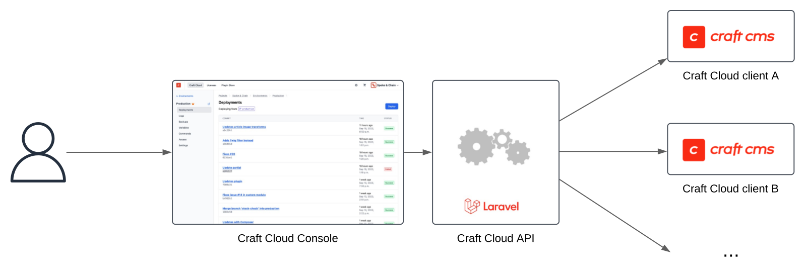
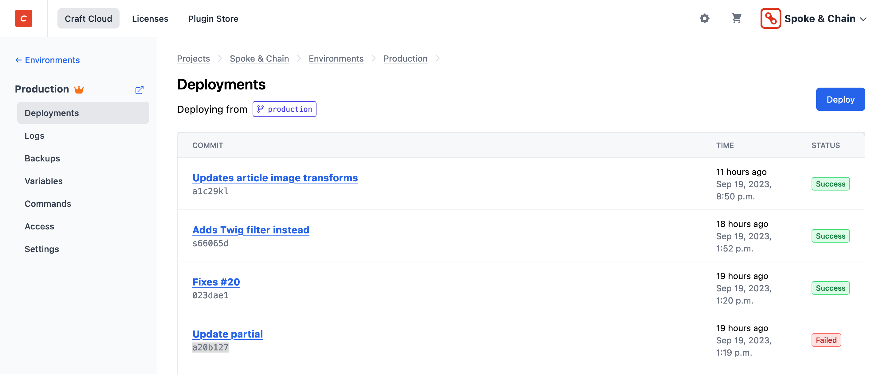
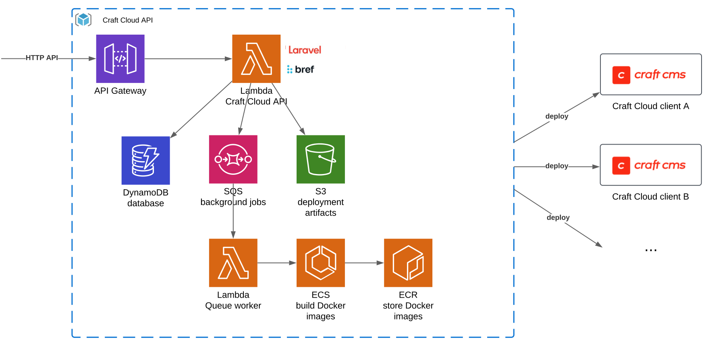
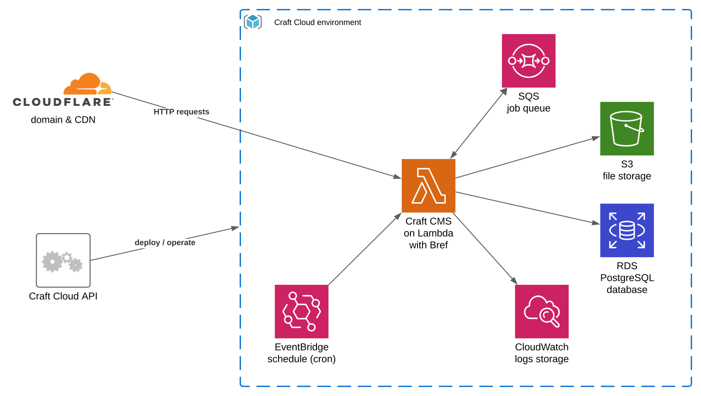
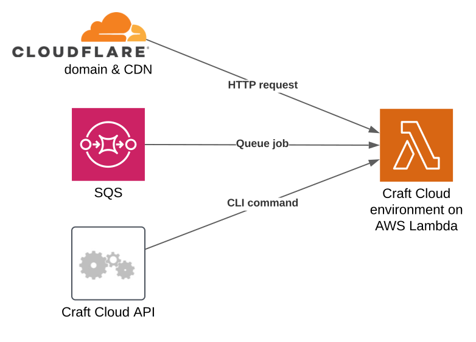
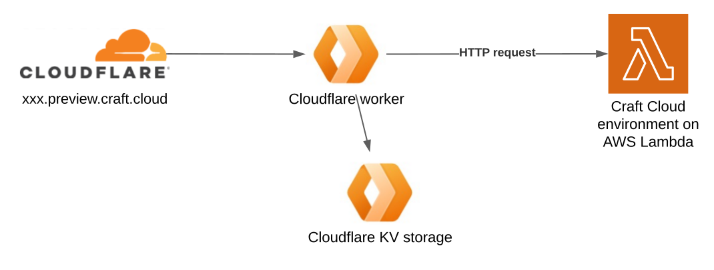

import { NextSeo } from 'next-seo';
import Image from 'next/image';
import illustration from './craft-cloud/illustration.png';

<NextSeo
    title="Bref case study: How Craft CMS built Craft Cloud"
    description="Craft Cloud is built on AWS and Cloudflare and uses Bref to run Craft CMS (and PHP) at scale on AWS Lambda" />

# How Craft CMS built Craft Cloud

    This case study dives into how the Craft CMS team created the Craft Cloud hosting platform using serverless technologies and Bref.

<a href="https://craftcms.com/cloud" target="_blank">
    <Image className="mt-6 rounded-lg shadow" src={illustration} />
</a>

[Craft CMS](https://craftcms.com/) is an open-source PHP CMS that powers more than 150,000 websites across the world. Last week, the Craft team launched [Craft Cloud](https://craftcms.com/cloud), a scalable hosting platform for Craft CMS users.

To make Craft Cloud secure and scalable while keeping infrastructure simple to maintain, the Craft team decided to **run Craft CMS serverless**.

To do so, Craft Cloud is built on AWS and Cloudflare and **uses Bref to run Craft CMS (and PHP) at scale on AWS Lambda**. In this case study, let’s explore in more detail how the Craft team built their cloud.

## Architecture overview

Craft Cloud is composed of several applications:

- The **Craft Cloud Console** is the UI that users can use to add, configure, and monitor their projects. The Console also allows users to create organizations, purchase plugins, and Craft licenses .
- The Console talks to the **Craft Cloud API**. The API is responsible for creating and updating the infrastructure for each customer’s project and environments.
- The **Craft Cloud environments** are where the customers' Craft CMS projects run. Each project runs in a separate environment based on a Git branch, ensuring projects and customers are isolated from each other.

## Craft Cloud Console

The Craft Cloud Console is the visible part: the web UI where users can sign up, create projects, and monitor them.

This is a Craft CMS application currently running on AWS ElasticBeanstalk (with plans to move onto Craft Cloud itself later). This UI talks to the Craft Cloud API to perform actions on projects.

## Craft Cloud API

This API is responsible for orchestrating all the customers' Craft Cloud projects: creating projects, databases, queues, as well as deploying the code, setting environment variables, etc.

It is implemented as a Laravel application and runs on AWS Lambda using Bref and [its Laravel bridge](https://bref.sh/docs/laravel/getting-started). Some of its operations can take time (for example when creating new AWS resources), which is why it uses [Laravel Queues set up with SQS](https://bref.sh/docs/laravel/queues). It also uses PostgreSQL and DynamoDB as databases, and S3 to store artifacts.

Each Craft Cloud project is deployed to AWS Lambda via a container image. The API builds these custom container images, one image for each project. That allows each project to run with a specific PHP version, environment variables, PHP extensions, etc.

The Craft Cloud API builds the Lambda container images using [Dagger](https://dagger.io) (Dagger is like writing Dockerfiles using Go), and a custom Go application that orchestrates and inspects the builds. These builds run on ECS (Fargate), as AWS Lambda cannot build Container images directly.

## Craft Cloud environments

Craft Cloud environments are the key part of the infrastructure: they run Craft CMS customer projects. These run serverless with Bref on AWS Lambda, using the container images built by the Craft Cloud API.

In each environment, Craft CMS customer projects have automatic access to a MySQL or PostgreSQL database, S3 for storing files, a job queue preconfigured with SQS, commands, and logs storage in CloudWatch. Customers can also choose the AWS regions in which their application will run.

### AWS Lambda events

Each customer project can run in multiple environments (dev, staging, production, etc.), each running in a single AWS Lambda function.

That means that **one AWS Lambda function handles multiple events**:

- HTTP invocations to serve the web app
- SQS invocations to process [queue jobs](https://craftcms.com/docs/4.x/extend/queue-jobs.html)
- Command invocations to manually trigger [console commands](https://craftcms.com/docs/4.x/console-commands.html)

While unusual on AWS Lambda, the Craft team made this design choice to keep the architecture straightforward (1 function per environment), as well as simplify management. This choice has been working out successfully so far.

To achieve this, the Bref runtimes [had to be customized](https://github.com/craftcms/cloud-extension-yii2/blob/1.x/src/runtime/event/EventHandler.php) so that a central “event router” dispatches AWS Lambda invocations to the correct Craft CMS handler (HTTP, queue, command, etc.).

### NATS.io

When building a multi-regional application, some tasks need to be region-specific for data privacy and performance. Examples of these tasks include builds, database backups, and running Craft Commands. To support region-specific tasks, Craft Cloud uses NATS.io and Synadia Cloud to stream events to the region where the work needs to occur.

### Domain names & CDN

Every Craft Cloud project gets a preview domain name in the form: `xxx.preview.craft.cloud`. Customers are then free to set up their own custom domains.

To serve these dynamic preview domains, Craft Cloud uses the Cloudflare CDN, with its [SSL for SaaS](https://www.cloudflare.com/application-services/products/ssl-for-saas-providers/) feature and its [Cloudflare Workers](https://workers.cloudflare.com/).

Cloudflare Workers are serverless functions written in JavaScript and running in edge locations (unlike AWS Lambda’s default behavior which runs in data centers). Workers also come with [Workers KV](https://www.cloudflare.com/developer-platform/workers-kv/), a simple and fast key-value storage. Workers are in essence limited: they can only run a subset of JavaScript, do not get access to a filesystem, etc. But these limits allow running Workers in edge locations, close to users, without cold starts, and with very low latency. This makes them very useful for doing dynamic routing: exactly what Craft Cloud does.

Whenever a new project environment is created, the Craft Cloud API creates a new Worker KV storage entry. Then, on every request to `xxx.preview.craft.cloud`, a Worker compares the domain name to the KV database, retrieves the entry for the project/environment, and invokes the AWS Lambda function that runs the Craft CMS project.

The Craft team decided to go with Cloudflare instead of a solution like AWS API Gateway or CloudFront because it did not impose limits on the number of custom domains that could be set up. Another benefit of Cloudflare is that it allows caching entire HTTP responses to help serve websites faster to users. This is a key feature of Craft Cloud: static caching is enabled by default to improve latency on all hosted websites.

### Running Craft CMS and Yii on AWS Lambda

Craft CMS is built on top of the [Yii PHP framework](https://www.yiiframework.com/). While Bref provides native integrations for [Laravel](https://bref.sh/docs/laravel/getting-started) and [Symfony](https://bref.sh/docs/symfony/getting-started), it does not for Yii. That means Yii had to be customized to run on AWS Lambda.

The Craft team published this as an open-source package on GitHub: [github.com/craftcms/cloud-extension-yii2](https://github.com/craftcms/cloud-extension-yii2).

This package pre-configures Craft CMS and Yii to:

- Publish assets to S3 so that they are served by the CDN
- Store data files on S3 instead of the local disk
- Store temporary files in /tmp
- Send background jobs to SQS
- Write logs to stderr so that they are automatically collected to AWS CloudWatch

It also provides helpers to reference assets served via the CDN, detect whether the app is running in Craft Cloud, and more.

## Conclusion

By building on top of cloud primitives, like AWS Lambda, SQS, S3, and Cloudflare workers, the Craft team is able to build a PaaS that is secure and scalable while keeping the maintenance effort manageable.

With this architecture, Craft Cloud has served over **310 million HTTP requests and 6TB of data** in the last 30 days.

Having been able to help the Craft team adopt Bref and AWS Lambda over the last few years, I am personally very excited to see the project go live, and I want to congratulate them for the launch! Running PHP online deserves to be simpler, and Craft is making it happen!

A huge thank you to the [Craft](https://craftcms.com/) team for being a long-term sponsor of Bref, and thank you [Jason](https://www.linkedin.com/in/jason-mccallister) for sharing that story with us!
