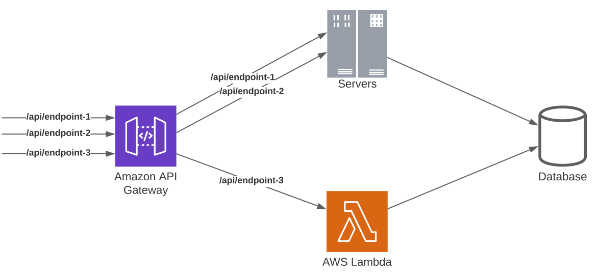
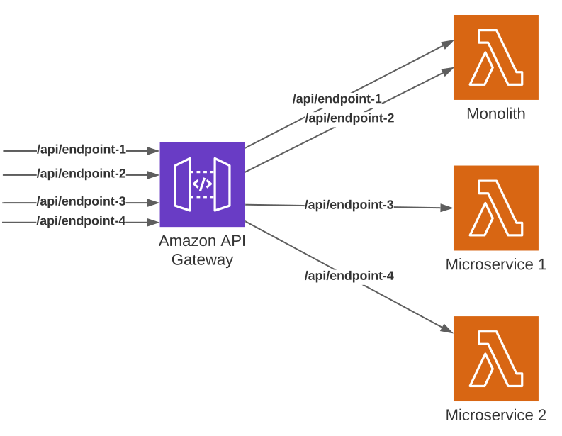

import { NextSeo } from 'next-seo';
import Image from 'next/image';
import illustration from './treezor/treezor-illustration.jpeg';

<NextSeo
    title="Bref case study: How Treezor runs a serverless banking platform with Bref"
    description="Treezor migrated a legacy PHP application from servers to serverless on AWS Lambda. They gained increased scalability, faster response times and fewer production incidents." />

# Treezor: a serverless banking platform

    This case study dives into how Treezor went serverless for their banking platform.
    From legacy code running on servers to a serverless monolith, and then event-driven microservices on AWS with Bref.

<Image className="mt-6 rounded-lg" src={illustration} />

[Treezor](https://www.treezor.com/) is a banking-as-a-service platform that serves millions of transactions every day. **You might be using it every day** through its clients: neobanks, employee benefit cards, company travel cards, and many other financial services.

Because Treezor's clients have very different use cases, the platform's infrastructure must be able **to scale and be resilient** to accommodate various usage patterns. Whether it's a luncheon voucher transaction spike at lunchtime or a monthly batch of transactions by corporate clients. On top of that, some API endpoints need to respond fast, **in near real-time**, for example to authorize live credit card payments.

To build such a platform, Treezor migrated from a legacy PHP application running on servers to a serverless architecture running on AWS Lambda with Bref. They did such a migration in 3 steps:

- First, they validated the serverless infrastructure by building a new service as a serverless PHP application.
- Then, they did a "lift-and-shift" migration by **running the legacy PHP application on AWS Lambda**.
- Finally, they slowly refactored the legacy application into multiple **PHP microservices** using the "strangler" pattern.

Let's explore this serverless migration in more detail.

## The original legacy stack

The original stack was a legacy PHP monolith, built with no framework, running on [OVH](https://ovh.com/) servers.

That monolith was responsible for the "Core Banking" API, i.e. handling all the critical operations of the system, like authorizing credit card payments or executing bank transfers.

Because it was running on servers, handling unpredictable traffic spikes was challenging.

## Validating the serverless infrastructure

Migrating a Core Banking system to a new infrastructure is not something you do every day. To make sure that AWS and [AWS Lambda](https://aws.amazon.com/lambda/) were a good fit, the team first wanted to validate the stack.

They did so by **building a new service entirely serverless** (greenfield project). They built it using PHP, Lumen, Bref, AWS Lambda, SQS, DynamoDB, SNS, S3, and KMS.

That new service was the API exposed to Treezor's client to manage day-to-day bank operations. It was deployed to production at the end of 2020 and was a success. It was able to scale and handle the incoming traffic.

To confirm that serverless worked well with other use cases, including the most complex ones, they did a second migration and **routed a part of live credit card transactions to the new serverless app**. If it worked with the live credit card traffic, it meant that the rest of the Treezor platform could run as serverless too.

That migration was also a success and cleared the way for migrating more APIs.

## Lift-and-shift the legacy monolith on AWS Lambda

The next step was to migrate the legacy PHP monolith from servers to AWS Lambda.

Doing [a complete rewrite was unrealistic](https://www.joelonsoftware.com/2000/04/06/things-you-should-never-do-part-i/). It would have meant completely halting all other developments, investing months (or even years) into the new system, and crossing fingers for the rewrite to actually be a success.

Instead, the team used Bref's [PHP-FPM runtime](/docs/runtimes/fpm-runtime). This AWS Lambda runtime runs PHP "as usual", like on any server, using PHP-FPM. It allowed taking the monolithic codebase and running it as an HTTP application on AWS Lambda.

To do a controlled migration, the team deployed the application both to the servers and to AWS Lambda. **Only 10 lines of code needed to be changed** to run the monolith on AWS Lambda.

Using API Gateway, they were able to **route some of the API traffic to AWS Lambda and the rest to the old stack running on servers**. In case of any issue, it was possible to roll back the endpoint to the server stack.

In October 2021, they successfully migrated their first API route to AWS Lambda, the most critical one handling all live credit card transactions. Over the following year, more and more API endpoints were migrated away from the servers to AWS Lambda.

The migration of other API endpoints started in March 2022. Over the following year, the team migrated all API endpoints, cron tasks, and batch scripts to AWS Lambda. The servers were finally shut down in March 2023.

The entire migration took 1 year of planning and design, and 1 year of implementation. The main challenge was dealing with cron tasks running for more than 15 minutes (the maximum execution time on AWS Lambda). They needed to be split into smaller tasks. The Bref runtime also needed some customizations, for example to run custom PHP versions.

**The migration was a complete success**, and this is reflected in the key metrics tracked for the migration. With the new serverless stack:

- API response times were **2.5 times faster**.
- On-call alerts were **divided by 2** or even 3 times.
- API endpoint timeouts for card transactions were **reduced by a factor of 10**.

## Refactoring to serverless microservices

Now that the infrastructure was running smoothly, the team turned to the code itself. The goal: turning the legacy PHP monolith into a maintainable system.

Headcount in the Treezor IT department was growing and having all teams work on a single monolith was painful. The target architecture was set: a collection of **domain-oriented microservices**.

The use of API Gateway routing turned useful here too: it allowed applying the "strangler" pattern. As each domain was spun out into a separate service, the API Gateway routes could be transparently updated to point to the new services.

The migration to microservices is still an ongoing work. As of today, the stack is **90% serverless on AWS** and deployed with Terraform.

Some new services are implemented in Go, but a majority are using PHP with Bref. API Gateway is used for [HTTP APIs](/docs/use-cases/http), and EventBridge is used for [asynchronous communication between services](/docs/use-cases/eventbridge). Other AWS services are used inside services to handle specific use cases, for example [job queues with SQS](/docs/use-cases/sqs), DynamoDB databases, SNS for parallelizing tasks, or even Kinesis for data pipelines.

## Conclusion

I find Treezor's story fascinating because it illustrates two very different use cases:

- Being able to **lift and shift** existing PHP applications to AWS Lambda with very few changes.
- And later going "all-in" on **event-driven microservices** and taking full advantage of what AWS has to offer.

It shows that both options are valid and have their own benefits.

First, **using AWS Lambda as a scalable PHP hosting platform works well**. For those who want scalability and simplicity, it is possible to avoid vendor lock-in and use AWS Lambda like any other hosting platform.

Second, AWS Lambda has great integrations with other AWS services. That allows building **event-driven microservices by composing the best AWS services for the use case**: SQS for infinitely scalable queues, EventBridge for asynchronous communication between services, DynamoDB for very optimized data storage, API Gateway for out-of-the-box caching, security and advanced routing for APIs... And much more of course.

Treezor's story also shows that the first option can be a good stepping stone to the second, removing some of the risk of a cloud migration.

Thank you [Treezor](https://www.treezor.com/), and thank you [Nicolas](https://www.linkedin.com/in/nicolasbordes/) and [Julien](https://www.linkedin.com/in/julien-mortuaire-29126528/) for sharing that story with us!

And if you want to work with Bref every day, [Treezor is hiring](https://www.welcometothejungle.com/fr/companies/treezor) 😉
