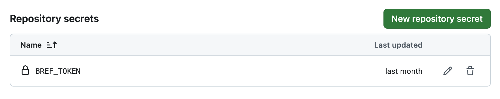

import { Callout, Steps, Cards, Card } from 'nextra/components';
// Path relative to the copy in the `website/` folder
import { LaravelIcon } from '../../components/icons/LaravelIcon';
import { SymfonyIcon } from '../../components/icons/SymfonyIcon';
import { NextSeo } from 'next-seo';

<NextSeo description="How to deploy Bref application using Bref Cloud." />

# Deployment

Bref Cloud deploys application using Bref's `serverless.yml` file.

If you haven't gotten started with Bref, follow the guide corresponding to your framework:

<Cards num={2}>
    <Card icon={<LaravelIcon />} title="Get started with Laravel" arrow="true" href="/docs/laravel/getting-started" />
    <Card icon={<SymfonyIcon />} title="Get started with Symfony" arrow="true" href="/docs/symfony/getting-started" />
    <Card title="Get started with any PHP framework" arrow="true" href="/docs/default/getting-started" />
</Cards>

The main difference with Bref Cloud is that you don't deploy by running `serverless deploy`. Instead, you deploy by running:

```shell
bref deploy
```

(see [the Getting Started guide](./cloud-getting-started.mdx) to install the `bref` CLI)

The benefits of deploying using Bref Cloud:

- **Credentials**: You don't need to create AWS credentials or configure the `serverless` CLI, Bref Cloud handles this for you ([learn more](./cloud-security.mdx)).
- **Deployment monitoring**: Bref Cloud provides a dashboard to view deployments of all your applications across all AWS accounts, regions, and environments.
- **No need to install `serverless`**: Bref Cloud transparently installs and runs the `serverless` CLI.
- **Better UX**: the `bref` CLI has minimal output with verbose mode that can be enabled in real time.

When you run `bref deploy`, Bref Cloud runs the `serverless deploy` command for you in the background.

## Differences between `bref` and `serverless`

The `bref` CLI uses AWS credentials from AWS accounts connected in [Bref Cloud](https://bref.cloud/aws-accounts). That means that it will ignore AWS credentials configured on your machine.

The `bref` CLI also uses the [open-source fork of Serverless Framework](https://github.com/oss-serverless/serverless), which is a fork of Serverless Framework v3, the last free and open-source version. This fork is maintained by Bref and ensures that the CLI is maintained and stable in the long run.

Finally, the `bref` CLI uses "**environments**" instead of "**stages**". This is just a vocabulary change. That means that you should use the `--env` option instead of the `--stage` option:

```shell
bref deploy --env production

# is equivalent to
serverless deploy --stage production
```

## Deploying with Bref Cloud

To deploy an application using Bref Cloud, you need to add your Bref Cloud team to the `serverless.yml` file:

```yaml
service: my-app
provider:
    name: aws
    # ...

# Add these lines:
bref:
    team: my-bref-cloud-team
```

(you can find your team name [in Bref Cloud](https://bref.cloud/app/create))

Then, you can deploy using the `bref` CLI:

```shell
bref deploy

# or for a specific environment
bref deploy --env production
```

## Deploying from GitHub Actions

You can also deploy your application using GitHub Actions.

First, make sure you have set up the `bref.team` option in `serverless.yml` as shown in the section above.

Then, create a `.github/workflows/deploy.yml` workflow. Here is an example workflow you can use as a starting point:

```yaml
name: Deploy

on:
    push:
        branches: [ main ]

jobs:
    deploy:
        runs-on: ubuntu-latest
        timeout-minutes: 15
        concurrency: deploy-prod # Avoid deploying concurrently
        environment:
            name: prod
            # Optionally set a URL for the environment
            # url: https://example.com
        steps:
            -   uses: actions/checkout@v4

            -   uses: actions/setup-node@v2
                with:
                    node-version: '18'

            -   name: Cache NPM dependencies
                uses: actions/cache@v4
                with:
                    path: ~/.npm # npm cache files are stored in `~/.npm`
                    key: ${{ runner.OS }}-node-${{ hashFiles('**/package-lock.json') }}
                    restore-keys: |
                        ${{ runner.OS }}-node-

            # You can remove this step if you don't have a `package.json` file
            -   run: npm ci

            -   name: Setup PHP
                uses: shivammathur/setup-php@v2
                with:
                    php-version: '8.2'
                    coverage: none
                    # Install the Bref CLI as a global tool
                    tools: bref/cli

            -   uses: ramsey/composer-install@v3
                with:
                    composer-options: '--optimize-autoloader --no-dev'

            -   run: bref deploy --env=prod
                env:
                    BREF_TOKEN: ${{ secrets.BREF_TOKEN }}
```

<Callout>
    Depending on your framework, you may need to add extra steps to build your application. For example with Laravel or Symfony you may want to build assets before deploying.
</Callout>

Finally, you need to add the `BREF_TOKEN` secret to your repository:

- [Create a "bot token" in your Bref Cloud team](https://bref.cloud/)
- Go to your repository on GitHub
- Click on "Settings" > "Secrets and variables" > "Actions" > "New repository secret"
- Set the name to `BREF_TOKEN` and the value to the token you received after creating the bot token



That's it! Your application will be deployed automatically when you push to the main branch. On the first deployment, the application will appear in the Bref Cloud dashboard.
