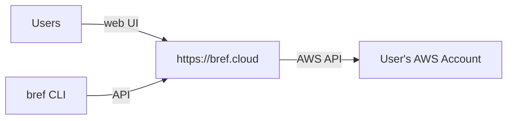
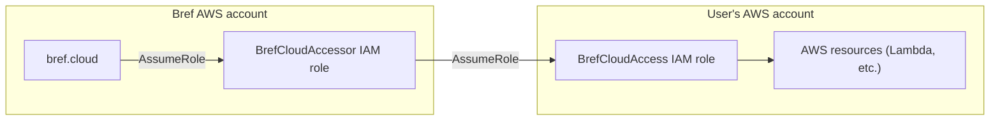
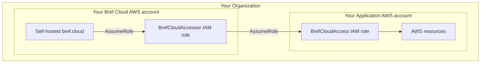

import { NextSeo } from 'next-seo';
import { Callout } from 'nextra/components';

<NextSeo description="How Bref Cloud securely accesses your AWS accounts." />

# Secure access to your AWS accounts

Bref Cloud accesses your AWS accounts to deploy and manage resources, such as AWS Lambda, S3 buckets, etc. To do this, it interacts with AWS via its SDK and API.

Instead of using long-lived AWS credentials (access keys), Bref Cloud uses IAM roles with temporary credentials following AWS best practices. This document explains how Bref Cloud accesses these AWS accounts securely in more detail.

## Introduction

"Accessing an AWS account" means that Bref Cloud perform actions in the account, like creating a Lambda function or an S3 bucket. Practically, this is done via the AWS API using the AWS SDK.

To use the AWS API, Bref Cloud needs **AWS credentials** that give access to the target account.

Bref Cloud does not use long-lived AWS credentials (aka AWS access keys). Instead, it follows standard AWS best practices and uses IAM roles with [temporary credentials](https://docs.aws.amazon.com/IAM/latest/UserGuide/best-practices.html#bp-workloads-use-roles).

## How it works

When you connect an AWS account to Bref Cloud, Bref Cloud creates a `BrefCloudAccess` IAM role in your account (you can also create it manually if you prefer). This role:

- gives permissions to access specific resources in your account (like Lambda functions)
- can only be "assumed" by the `BrefCloudAccessor` role from the Bref Cloud AWS account (called a "trust policy").

When Bref Cloud needs to access your account, it:

1. assumes the `BrefCloudAccessor` role in its own AWS account
2. uses this new role to assume the `BrefCloudAccess` role in your AWS account
3. gets temporary credentials that have the permissions of the `BrefCloudAccess` role

These credentials are valid for a short period of time. Bref Cloud uses them to perform the actions you requested (like retrieving logs). They are also passed to the `serverless deploy` command when deploying your application, so that the command uses these temporary credentials without you having to do anything.

Bref Cloud does not store these credentials. They are only used for the duration of the operation.

### Why use IAM roles?

IAM roles are the recommended way to grant access to AWS resources over long-lived credentials (like access keys). Access keys can be leaked and are hard to rotate. IAM roles can only be used by the Bref AWS account.

Thanks to IAM roles, **Bref Cloud does not store AWS credentials**.

You can also transparently review the permissions that Bref Cloud has in your account, adjust them (the IAM role lives in your account), or revoke access at any time by deleting the `BrefCloudAccess` role from your account.

### Why use a separate `BrefCloudAccessor` role?

The `BrefCloudAccessor` role is an additional layer of security: instead of directly granting the PHP application (Bref Cloud) access to your account, it jumps through an intermediate role (`BrefCloudAccessor`).

The reasons for this are:

- We can very tightly restrict access to this role (principle of least privilege). For example Bref AWS account administrators (IAM users) do not have access the `BrefCloudAccessor` role.
- The PHP application is deployed often, but the `BrefCloudAccessor` role should almost never change. Separating those helps avoid accidental unwanted changes.

### What permissions does the `BrefCloudAccess` role have?

By default, the `BrefCloudAccess` role has a set of permissions that allows Bref Cloud to deploy and manage your applications. For example, it can create AWS resources (like Lambda functions) via CloudFormation, read logs and metrics, etc. When you set up Bref Cloud, you can review these permissions in the IAM role that is created in your account.

You can also customize the permissions of the `BrefCloudAccess` role if you want to restrict it further. Of course, all Bref Cloud features may not work correctly in some cases if you restrict the permissions too much.

### How does Bref Cloud know which role to assume?

When you connect your AWS account to Bref Cloud, the ARN of the `BrefCloudAccess` role is stored in Bref Cloud. This is how Bref Cloud knows which role to assume in your account.

### A note about `ExternalId`

Bref Cloud follows AWS best practices and uses the [`ExternalId` feature for cross-account access](https://docs.aws.amazon.com/IAM/latest/UserGuide/id_roles_create_for-user_externalid.html).

The `ExternalId` is a unique identifier that is passed by Bref Cloud when assuming the role. This identifier is configured when the role is created, and is checked by AWS when the role is assumed.

External IDs are randomly generated *per Bref Cloud team* and are stored encrypted in the Bref Cloud database.

This technique has the following benefits:

- It ensures that only a specific Bref Cloud team can assume the role and access your account (protection against the "confused deputy" problem).
- In case of an extreme security breach where the `BrefCloudAccessor` IAM role is compromised, the attacker would not be able to access customer AWS accounts (the `ExternalId` acts as an additional layer of security).
- On top of that, the `ExternalId` being stored in the database means that the attacker would need to also compromise the database to get it, which is an additional layer of security.
- On top of that, the `ExternalId` being stored encrypted means that the attacker would also need to compromise the encryption key to get it (stored separately from the code and the database), which is another additional layer of security.

Note that nothing is foolproof, but having multiple layers of security helps mitigate risks.

## Self-hosted Bref Cloud

Self-hosting means running Bref Cloud inside your own AWS account. This is useful for companies that have strict security requirements and do not want to give access to a third-party service to their AWS account.

When you self-host Bref Cloud, cross-account access happens as usual but the big difference is that access happens from an AWS account that you own to another AWS account that you own.

## Frequently Asked Questions

### Can I revoke Bref Cloud's access to my AWS account?

Yes, you can revoke access at any time by deleting the `BrefCloudAccess` IAM role from your AWS account.

### How does Bref Cloud handle multi-account deployments?

If you need to deploy to multiple AWS accounts, you can connect each account to Bref Cloud separately. Each account will have its own `BrefCloudAccess` IAM role with appropriate permissions.

### How often are temporary credentials refreshed?

Temporary credentials are only used for the duration of specific operations and are not stored. They typically have a short lifespan (usually 15 minutes), or even just the duration of an HTTP request.

### Can I audit what actions Bref Cloud performs in my account?

You can enable [AWS CloudTrail](https://aws.amazon.com/cloudtrail/) to log all actions made in your AWS account. This allows you to audit the actions performed by Bref Cloud.

### Can I customize the permissions granted to Bref Cloud?

Yes, you can modify the permissions in the `BrefCloudAccess` IAM role to restrict what Bref Cloud can do in your AWS account. However, restricting permissions too much may prevent certain Bref Cloud features from working correctly. Feel free to reach out to Bref Cloud support if you need help with this.

### Does Bref Cloud comply with my organization's security requirements?

Bref Cloud follows AWS security best practices, including the principle of least privilege, temporary credentials, and cross-account access controls. For organizations with specific compliance requirements (like SOC2, HIPAA, etc.), you may want to consider the self-hosted option for complete control over the infrastructure.
