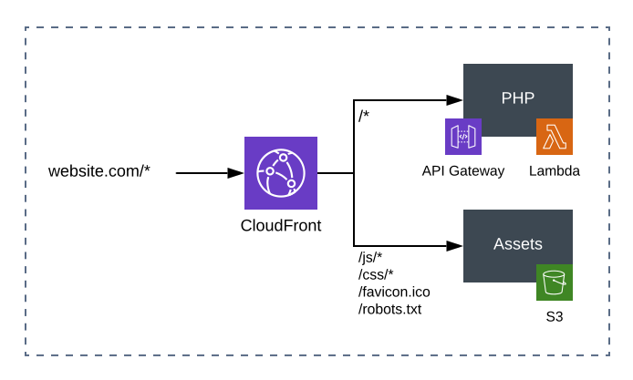

> Before reading this article we assume that you have read [Bref's introduction](/docs/default/first-steps.md) and that you are familiar with [Bref's HTTP runtime](/docs/web-apps/index.md).

## Architectures

Websites usually contain 2 parts:

- PHP code, running on [AWS Lambda + API Gateway with the HTTP runtime](/docs/web-apps/index.md)
- static assets (CSS, JS…), [hosted on AWS S3](https://docs.aws.amazon.com/AmazonS3/latest/dev/WebsiteHosting.html)



[CloudFront](https://aws.amazon.com/cloudfront/) (the AWS CDN) serves as an HTTP/HTTPS proxy.

This lets us host everything under the same domain and support both HTTP and HTTPS.

The easiest approach is to use the <a href="https://github.com/getlift/lift/blob/master/docs/server-side-website.md">Server-side website construct of the Lift plugin</a>. If you don't want to use it, see the [alternative solutions](#alternative-solutions).

First install the plugin

```bash
serverless plugin install -n serverless-lift
```

Then add this configuration to your `serverless.yml` file.

```yaml
service: my-app

provider:
  ...

plugins:
  - ./vendor/bref/bref
  - serverless-lift

functions:
  ...

constructs:
  website:
    type: server-side-website
    assets:
      '/js/*': assets/js
      '/css/*': assets/css
      '/favicon.ico': assets/favicon.ico
      '/robots.txt': assets/robots.txt
      # add here any file or directory that needs to be served from S3
```

Now deploy your website using `serverless deploy`. Lift will create all required resources and take care of 
uploading your assets to S3 automatically.

You can access your website using the URL that Lift outputs at the end the deployment.

> The first deployment takes a lot of time (5 to 10 minutes) because CloudFront is a distributed service. The next deployments that do not modify CloudFront's configuration will not suffer from this delay.

### Setting up a domain name

Just like in the "[Custom domains](/docs/environment/custom-domains.md)" guide, you need to register your domain in **ACM** (AWS Certificate Manager) to get an HTTPS certificate.

> If you have already set up this domain as a custom domain in API Gateway (by following the [Custom domain](/docs/environment/custom-domains.md) guide), you will need to remove it before continuing.

- open [this link](https://console.aws.amazon.com/acm/home?region=us-east-1#/wizard/) or manually go in the ACM Console and click "Request a new certificate" **in the `us-east-1` region** (CloudFront requires certificates from `us-east-1`)
- add your domain name and click "Next"
- choose the domain validation of your choice
    - domain validation will require you to create DNS entries (this is **recommended** because it renews the certificate automatically)
    - email validation will require you to click a link you will receive in an email sent to `admin@your-domain.com`

Copy the ARN of the ACM certificate. It should look like this:

```
arn:aws:acm:us-east-1:216536346254:certificate/322f12ee-1165-4bfa-a41f-08c932a2935d
```

Now add your domain name and certificate in your `serverless.yml` file

```yaml
...
constructs:
  website:
    # ...
    domain: mywebsite.com
    certificate: <your certificate ARN>
```

The last step will be to point your domain name DNS records to the CloudFront URL:

- copy the domain outputted by Lift during `serverless deploy`  (or run `serverless info` to retrieve it)
- create a CNAME to point your domain name to this URL
    - if you use Route53 you can read [the official guide](https://docs.aws.amazon.com/Route53/latest/DeveloperGuide/routing-to-cloudfront-distribution.html)
    - if you use another registrar and you want to point your root domain (without `www.`) to CloudFront, you will need to use a registrar that supports this (for example [CloudFlare allows this with a technique called CNAME flattening](https://support.cloudflare.com/hc/en-us/articles/200169056-Understand-and-configure-CNAME-Flattening))

Lift supports more advanced use cases like multiple domains, root domain to `www` redirects, and more. Check out <a href="https://github.com/getlift/lift/blob/master/docs/server-side-website.md">the official documentation</a>.

## Alternative solutions

If you don't want to use Lift or Cloudfront, you may want to read the <a href="https://github.com/brefphp/bref/blob/d1dd690d020cd03f134010db456bb61a6d0ffafb/docs/websites.md#architectures">older version of this documentation</a> which featured configuration using S3 only on a separate domain and Cloudfront configured through plain CloudFormation.
