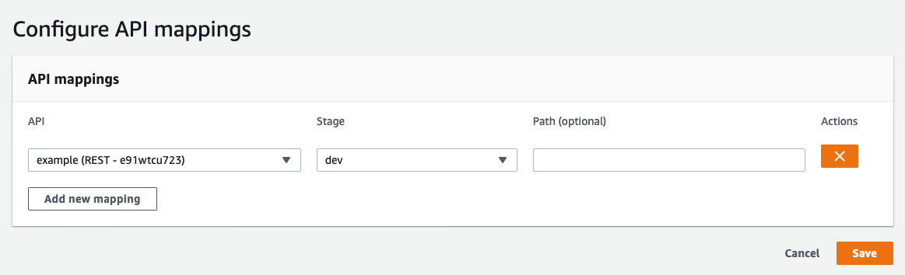

AWS generates random domain names for [HTTP applications](/docs/runtimes/http.md):

```
https://<random>.execute-api.<region>.amazonaws.com/Prod/
```

It is possible to replace those URLs by a custom domain.

> These guides assume you already own the domain name you will want to use.

## Custom domains for HTTP lambdas

The first thing to do is register the domain in **ACM** (AWS Certificate Manager) to get a HTTPS certificate. This step is not optional.

- open [this link](https://console.aws.amazon.com/acm/home?region=us-east-1#/wizard/) or manually go in the ACM Console and click "Request a new certificate" in the `us-east-1` region (the region used for global "edge" certificates)
- add your domain name and click "Next"
- choose the domain validation of your choice
    - domain validation will require you to add entries to your DNS configuration
    - email validation will require you to click a link you will receive in an email sent to `admin@your-domain.com`

After validating the domain and the certificate we can now link the custom domain to our application via API Gateway.

- open [API Gateway's "Custom Domain" configuration](https://eu-west-3.console.aws.amazon.com/apigateway/home#/custom-domain-names)
- **switch to the region of your application**
- click "Create Custom Domain Name"
- enter your domain name, select the certificate you created above and save
- edit the domain that was created
- add a "Path mapping" to map the `/` URL (or any URL you want) to your HTTP application in the `Prod` stage, for example:

  
- after clicking "Save", note the URL in the `Target Domain Name` section (`<random>.cloudfront.net`)
- create a CNAME entry in your DNS to point your domain name to this `<random>.cloudfront.net` domain

After waiting for the DNS change to propagate (sometimes up to 24 hours) your website is now accessible via your custom domain.

## Custom domains for static websites on S3

Some applications expose a static website hosted on AWS S3. In those cases the URL will look like this:

```
http://<bucket>.s3-website.<region>.amazonaws.com/
```

To use a custom domain for a S3 static website the process lies in 2 steps:

- name the S3 bucket like the wanted domain name

  For example for the http://www.example.com website, the S3 bucket has to be named `www.example.com`
- point the domain to the S3 URL via DNS

  In our example the DNS entry to create would be a CNAME for `www.example.com` pointing to `www.example.com.s3-website.us-east-1.amazonaws.com`

> S3 static websites do not support HTTPS. To add HTTPS to your website for free it is possible to use a CDN like [CloudFlare](https://cloudflare.com/) (simplest) or AWS CloudFront.
