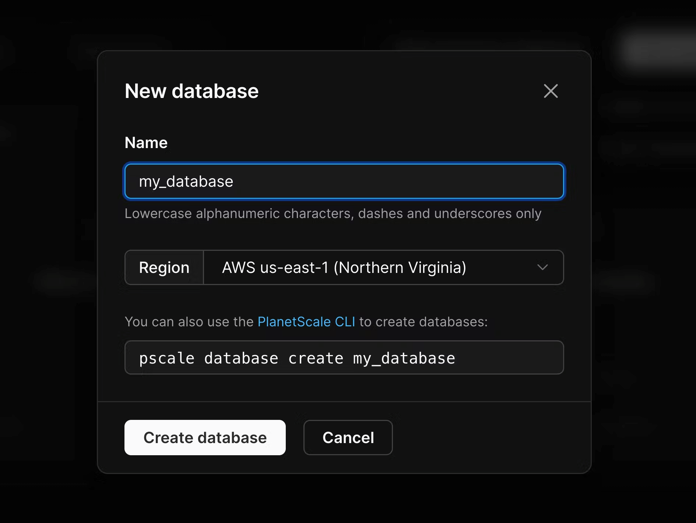

[PlanetScale](https://planetscale.com/) is a hosted serverless MySQL database based on the Vitess engine ([learn more](https://planetscale.com/docs/concepts/what-is-planetscale)).

Amongst other features, it offers the following benefits compared to running a database on AWS:

- Simple to set up: no VPC (virtual private network) to set up, no instances to configure.
- Runs [the Vitess clustering system](https://planetscale.com/blog/vitess-for-the-rest-of-us), which offers better scalability and supports a lot more concurrent connections [via built-in connection pooling](https://planetscale.com/blog/one-million-connections).
- Offers a [free database in the Hobby plan](https://planetscale.com/pricing), and paid plans are usage-based.
- Since it does not require a VPC, we do not need to set up and pay [for a NAT Gateway](database.md#accessing-the-internet).

One extra feature worth mentioning is [the branching concept](https://planetscale.com/docs/concepts/branching): it enables testing schema changes before deploying them in production without downtime.

## Getting started

To use PlanetScale with Bref, start [by creating a PlanetScale account](https://planetscale.com/).

Then, create a database in the same region as your Bref application.



> The database is created with an initial development branch: `main`. PlanetScale [has a branching concept](https://planetscale.com/docs/concepts/branching) that lets you test schema changes in a development branch, then promote it to production, or even create new branches (isolated copies of the production schema) off of production to use for development.

You can now click the **Connect** button and select "Connect with: PHP (PDO)". That will let you retrieve the host, database name, user and password.

Here is a simple example that connects to the database using PDO and performs a few queries:

```php
<?php
$host = '<host>';
$dbname = '<database name>';
$user = '<user>';
$password = '<password>';

$pdo = new PDO("mysql:host=$host;dbname=$dbname", $user, $password, [
    PDO::MYSQL_ATTR_SSL_CA => openssl_get_cert_locations()['default_cert_file'],
]);

$pdo->exec('CREATE TABLE IF NOT EXISTS test (id INT NOT NULL AUTO_INCREMENT, name VARCHAR(255) NOT NULL, PRIMARY KEY (id))');
$pdo->exec('INSERT INTO test (name) VALUES ("test")');
var_dump($pdo->query('SELECT * FROM test')->fetchAll());
```

Note the `PDO::MYSQL_ATTR_SSL_CA` flag: while we connect via a username and password, [the connection happens over SSL](https://planetscale.com/docs/concepts/secure-connections) to secure against man-in-the-middle attacks. To avoid hardcoding the location of the file containing SSL certificates, we retrieve its path via `openssl_get_cert_locations()['default_cert_file']`.

In Bref, the file is located here: `/opt/bref/ssl/cert.pem`.

## Laravel

_This guide assumes you have already set up a Laravel application by following [the Bref documentation for Laravel](../frameworks/laravel.md)._

To configure Laravel to use the PlanetScale database, you need to set it up via environment variables.

If you deploy a `.env` file, set up the following variables:

```bash
DB_CONNECTION=mysql
DB_HOST=<host url>
DB_PORT=3306
DB_DATABASE=<database name>
DB_USERNAME=<user>
DB_PASSWORD=<password>
# Connect via SSL (https://planetscale.com/docs/concepts/secure-connections)
MYSQL_ATTR_SSL_CA=/opt/bref/ssl/cert.pem
```

If you don't deploy the `.env` file, you can configure the variables in `serverless.yml`:

```yaml
provider:
    # ...
    environment:
        DB_HOST: <host url>
        DB_DATABASE: <database name>
        DB_USERNAME: <user>
        DB_PASSWORD: ${ssm:/my-app/database-password}
        # Connect via SSL (https://planetscale.com/docs/concepts/secure-connections)
        MYSQL_ATTR_SSL_CA: /opt/bref/ssl/cert.pem
```

Note that the `DB_PASSWORD` value is sensitive and can be set up as a secret via SSM. Read about [Secret variables](./variables.md#secrets) to learn more.

Don't forget to deploy the changes:

```bash
serverless deploy
```

Now that Laravel is configured, you can run `php artisan migrate` in AWS Lambda to set up our tables:

```bash
serverless bref:cli --args="migrate --force"
```

Note: PlanetScale does not support foreign key constraints. If your application uses foreign key constraints, you will have to remove them before running `php artisan migrate`. See the [MySQL compatibility section](#mysql-compatibility) for more information.

That's it! Our database is ready to use.

## Symfony

_This guide assumes you have already set up a Symfony application by following [the Bref documentation for Symfony](../frameworks/symfony.md)._

First, make sure you have installed Doctrine, or [follow these docs to do so](https://symfony.com/doc/current/doctrine.html#installing-doctrine).

To configure Symfony to use the PlanetScale database, you need to set it up via environment variables.

If you deploy a `.env` file, set up the following variables:

```bash
DATABASE_URL="mysql://<USERNAME>:<PASSWORD>@<HOST_URL>:3306/<DATABASE_NAME>?serverVersion=8.0"
```

If you don't deploy the `.env` file, you can configure the variables in `serverless.yml`:

```yaml
provider:
    # ...
    environment:
        DATABASE_URL: ${ssm:/my-app/database-url}
```

Note that the `DATABASE_URL` value is sensitive and can be set up as a secret via SSM. Read about [Secret variables](./variables.md#secrets) to learn more.

Finally, edit the `config/packages/doctrine.yaml` configuration file to set up [the SSL connections](https://planetscale.com/docs/concepts/secure-connections):

```yaml
doctrine:
    dbal:
        url: '%env(resolve:DATABASE_URL)%'
        options:
            # Connect to the database via SSL
            !php/const PDO::MYSQL_ATTR_SSL_CA: /opt/bref/ssl/cert.pem

# ...
```

Let's deploy the changes:

```bash
serverless deploy
```

Now that Symfony is configured, you can run the `bin/console doctrine:migrations:migrate` command in AWS Lambda to set up our tables:

```bash
serverless bref:cli --args="doctrine:migrations:migrate"
```

Note: PlanetScale does not support foreign key constraints. If your application uses foreign key constraints, you will have to remove them before running your migrations. See the [MySQL compatibility section](#mysql-compatibility) for more information.

That's it! Our database is ready to use.

## MySQL compatibility

PlanetScale is based on the Vitess clustering system, which was built for scaling MySQL. Because of that, Vitess doesn't support all MySQL features.

The biggest change is that **foreign key constraints** are not supported. To be clear, it is possible to have references between rows of different tables and perform joins. But constraints are not enforced: foreign keys are no longer validated at the database level, and you cannot use `ON DELETE ...` statements.

That means that you should take care of validating references between rows and handle cascade deletions. If you use an ORM, you should be in a good place:

- **Laravel** DB migrations and Eloquent work fine. You can use [the `foreignId()` method](https://laravel.com/docs/migrations#foreign-key-constraints) to create relationships between tables, but you cannot enforce referential integrity with the `constrained()` method (and related methods like `onDelete('cascade')`).
- [**Doctrine**](https://www.doctrine-project.org/) works fine, but you should not use [`onDelete="CASCADE"` which relies on foreign key constraints](https://www.doctrine-project.org/projects/doctrine-orm/en/2.14/reference/working-with-objects.html#removing-entities) (`cascade=REMOVE` or `cascade=ALL` is fine Doctrine performs the cascade in memory via PHP).

You can read the [complete **MySQL compatibility table** on the PlanetScale website](https://planetscale.com/docs/reference/mysql-compatibility).

## Database import

PlanetScale provides an automated import tool to import an existing database without downtime. Check out [the documentation](https://planetscale.com/docs/imports/database-imports) to get started.

For simple scenarios, you can also use the [`mysqldump` tool](https://dev.mysql.com/doc/refman/8.0/en/mysqldump.html#mysqldump-syntax) to export your existing database and import it later in PlanetScale. Note that there are [specific options you need to use for Vitess](https://vitess.io/docs/15.0/user-guides/configuration-basic/exporting-data/#mysqldump). You also need to export the schema and the data separately because you will need to remove foreign key constraints from the schema.

Let's first export the schema and the data:

```bash
mysqldump -u <user> -p<password> -h <hostname> --set-gtid-purged=OFF --no-tablespaces --no-data <db-name> > schema.sql
mysqldump -u <user> -p<password> -h <hostname> --set-gtid-purged=OFF --no-tablespaces --no-create-info <db-name> > data.sql
```

Next, edit `schema.sql` to remove all foreign key constraints ([learn more](https://planetscale.com/docs/learn/operating-without-foreign-key-constraints)), for example:

```diff
CREATE TABLE products (
  id INT NOT NULL,
  category_id INT,
  PRIMARY KEY (id),
+ KEY category_id_idx (category_id)
- KEY category_id_idx (category_id),
- CONSTRAINT `category_fk` FOREIGN KEY (category_id) REFERENCES category(id)
);
```

(watch out for the trailing comma, else you might get errors like "You have an error in your SQL syntax")

Finally, you can import the `schema.sql` and `data.sql` into PlanetScale, **using the PlanetScale settings this time** (user, password, host):

```bash
mysql -u <user> -p<password> -h <hostname> <db-name> < schema.sql
mysql -u <user> -p<password> -h <hostname> <db-name> < data.sql
```

## Schema changes workflow

PlanetScale has a concept of [database branches](https://planetscale.com/docs/concepts/branching):

- [**Development** branches](https://planetscale.com/docs/concepts/branching#development-and-production-branches) are isolated copies of your production database and are used to test schema changes in development.
- [**Production** branches](https://planetscale.com/docs/concepts/branching#development-and-production-branches) are high availability branches intended for production traffic. They are protected from direct DDL, so you cannot perform direct schema changes on production branches.

You can set up production branches in two ways:

- either **allow** running DB migrations directly on your production database,
- or **forbid** direct schema changes in production by enabling [_Safe Migrations_](https://planetscale.com/docs/concepts/safe-migrations).

### Without "Safe Migrations"

If the production branch has the "Safe Migrations" feature **disabled**, you can run DB migrations on the production database as part of your deployment.

This strategy implies either:

- accepting downtime on deployment, for example by using [Laravel's maintenance mode](../frameworks/laravel.md#maintenance-mode) (put the app offline, deploy, run migrations, then put the app back online)
- or always writing backward-compatible DB migrations

This option works well for applications with low traffic or in early development. For high-traffic applications, using "Safe Migrations" is recommended instead.

### With "Safe Migrations"

If the production branch has the "Safe Migrations" feature **enabled**, you need to use development branches and deploy requests. Below is an introduction to these features.

You start with a development branch called `main`, which lets you set up your schema. Once set up, you can [promote](https://planetscale.com/docs/concepts/branching#promote-a-branch-to-production) that branch (or any other branch) to a production branch with "Safe Migrations" enabled.

Later, you can apply schema changes (aka DB migrations) to the production database **without downtime**:

1. In PlanetScale, create a new development branch off of the production branch. This is an isolated copy of the production schema that you can freely play around with.
2. Set up a dev environment of your application.
3. Run the DB migrations in the dev branch.
4. Test the changes in the dev environment.
5. In PlanetScale, deploy the DB changes to the production branch via a "deploy request".

Let's dive through these steps in the next section.

#### Deploying DB migrations in detail

PlanetScale works with **branches**, which matches with the concept of **stages** in Serverless Framework.

To deploy DB migrations in production, you can work with two environments:

- A **production** environment: our application deployed in the `prod` stage and configured to use the `production` PlanetScale branch. 
- A **dev** environment: our application deployed in the `dev` stage and configured to use the `development` PlanetScale branch. 

You can [deploy our applications to different stages](../deploy.md#stages) via the `--stage` option. Each stage is completely isolated from the others.

```bash
# Deploy the "dev" environment:
serverless deploy

# Deploy the "prod" environment:
serverless deploy --stage=prod
```

You want each "stage" of our application to connect to a different PlanetScale branch. You can achieve that in `serverless.yml` via [stage parameters](https://www.serverless.com/framework/docs/guides/parameters#stage-parameters):

```yaml
provider:
    # ...
    environment:
        # ...
        DB_HOST: <host url>
        DB_DATABASE: <database name>
        DB_USERNAME: ${param:db-user}
        DB_PASSWORD: ${param:db-password}

params:
    # These values apply for all stages by default
    default:
        # Connect to the "development" database in PlanetScale
        db-user: <user-for-dev-branch>
        db-password: ${ssm:/my-app/dev/db-password}
    # These values apply for the `prod` stage only
    prod:
        # Connect to the "production" database in PlanetScale
        db-user: <user-for-prod-branch>
        db-password: ${ssm:/my-app/prod/db-password}
```

In the example above, the `DB_USERNAME` and `DB_PASSWORD` environment variables will have different values based on the stage.

The next step is to [create the `development` branch off of the production branch](https://planetscale.com/docs/concepts/branching#create-a-development-branch). This branch will be an isolated copy of the production schema.

Now that the environments are set up, you can apply the following workflow for DB migrations:

1. Deploy your code changes and migrations in the development stage.
1. Apply DB migrations in the **development** environment (drop a column, add a table, etc.):
   - If you use Laravel, run DB migrations [via the `artisan` function](../frameworks/laravel.md#laravel-artisan): `serverless bref:cli --stage=dev --args="migrate"`
   - If you use Symfony, run DB migrations [via the `console` function](../frameworks/symfony.md#console): `serverless bref:cli --stage=dev --args="doctrine:migrations:migrate"`
   - If you don't use any framework, run DB queries [via the `pscale` CLI](https://planetscale.com/docs/reference/planetscale-cli).
1. Test changes in the development environment to make sure everything works correctly.
1. Create a deploy request.

    PlanetScale will create a schema diff that you can review before applying. It will also validate the diff and detect schema issues like missing unique keys, etc.

    Once reviewed and approved, you can add it to the deploy queue and PlanetScale will begin the deployment.

    The schema changes are deployed without downtime: no table gets locked, and production is not slowed down during the migration. This is what is called "[non-blocking schema changes](https://planetscale.com/docs/concepts/nonblocking-schema-changes)".

The migrations are now applied to production.

### When to apply migrations?

Depending on the schema change, you might want to apply DB migrations _before_ or _after_ a code deployment:

- **Add a column/table:** apply the migration _before_ deploying the code.
- **Remove a column/table:** apply the migration _after_ deploying the code.
- **Rename a column/table:** this scenario is more complex and needs to be addressed in two steps:
  - Apply migrations that **add** the column/table (it will be duplicated).
  - Deploy code changes to write new data to the new column/table, and read from both.
  - Run a script that copies the old data to the new column/table.
  - Deploy code changes to only read and write to the new column/table.
  - Apply migrations that **remove** the old column/table.

If you use Laravel, you can read a complete blog post about this topic: [Zero downtime Laravel migrations](https://planetscale.com/blog/zero-downtime-laravel-migrations#when-to-run-migrations).
