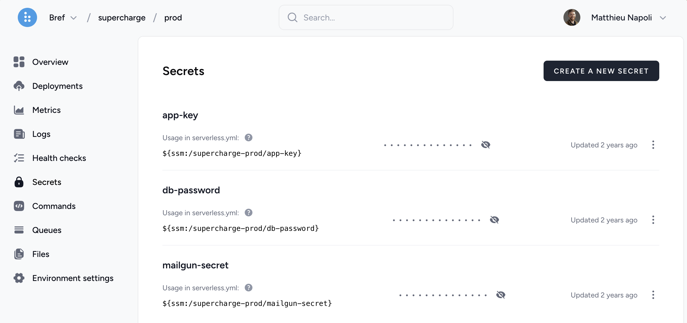

Environment variables are the perfect solution to configure the application (as recommended in the [12 factor guide](https://12factor.net/config)).

## Definition

Environment variables can be defined in `serverless.yml`.

To define an environment variable that will be available in **all functions** declare it in the `provider` section:

```yaml
provider:
    # ...
    environment:
        MY_VARIABLE: 'my value'
```

To define an environment variable that will be available in **a specific function** declare it inside the function's properties:

```yaml
functions:
    foo:
        # ...
        environment:
            MY_VARIABLE: 'my value'
```

> Do not store secret values in `serverless.yml` directly. Check out the next section to handle secrets.

## Secrets

Secrets (API tokens, database passwords, etc.) should not be defined in `serverless.yml` or committed into your git repository.

Instead, you can use the [SSM parameter store](https://docs.aws.amazon.com/systems-manager/latest/userguide/systems-manager-paramstore.html), a free service provided by AWS.

### Creating secrets

To create a parameter, you can do it via the [AWS SSM console](https://console.aws.amazon.com/systems-manager/parameters) or the [Bref Dashboard](https://dashboard.bref.sh/):



You can also do it in the CLI via the following command:

```bash
aws ssm put-parameter --region us-east-1 --name '/my-app/my-parameter' --type String --value 'mysecretvalue'
```

For Windows users, the first part of the path needs to be double slashes and all subsequent forward slashes changed to backslashes:
```bash
aws ssm put-parameter --region us-east-1 --name '//my-app\my-parameter' --type String --value 'mysecretvalue'
```

It is recommended to prefix the parameter name with your application name, for example: `/my-app/my-parameter`.

### Retrieving secrets

You can inject a secret in an environment variable:

- either at **deployment time** (simplest)
- or at **runtime** (more secure)

#### At deployment time

Use the [`${ssm:<parameter>}` syntax](https://serverless.com/blog/serverless-secrets-api-keys/) to have the variable be replaced by the secret value on deployment:

```yaml
provider:
    # ...
    environment:
        MY_PARAMETER: ${ssm:/my-app/my-parameter}

        # If you need to set a different value per stage:
        OTHER_PARAMETER: ${ssm:/my-app/${sls:stage}/my-parameter}
```

Advantages:

- Simpler, it just works.

Disadvantages:

- The user deploying must be allowed to retrieve the secret value.
- The secret value will be set in clear text in the Lambda function configuration (anyone who can access the function can also view the value).

#### At runtime

Alternatively, Bref can fetch the secret values at runtime when the Lambda function starts (aka the "cold start"). To use that feature, we **must install** the `bref/secrets-loader` package:

```
composer require bref/secrets-loader
```

To use it, the environment variable should contain the path to the SSM parameter prefixed with `bref-ssm:`. We also need to authorize Lambda to retrieve the parameter. For example:

```yaml
provider:
    # ...
    environment:
        MY_PARAMETER: bref-ssm:/my-app/my-parameter
    iam:
        role:
            statements:
                # Allow our Lambda functions to retrieve the parameter from SSM
                -   Effect: Allow
                    Action: ssm:GetParameters
                    Resource: 'arn:aws:ssm:${aws:region}:${aws:accountId}:parameter/my-app/my-parameter'
                    # If you want to be more generic you can uncomment the line below instead.
                    # But it authorizes retrieving *any* SSM parameter, which is less secure.
                    #Resource: '*'
```

On a cold start, Bref automatically checks all environment variables that start with `bref-ssm:` and will resolve the values by calling the AWS SSM API. It adds a very small latency overhead for the first request (note: all SSM values are fetched in a single API call).

Advantages:

- The value doesn't have to be accessible by the user deploying.
- The value is not stored in plain text in the AWS console.

Disadvantages:

- More complex configuration.
- Small added latency to cold starts.

### An alternative: AWS Secrets Manager

As an alternative, you can store secrets in [AWS Secrets Manager](https://aws.amazon.com/secrets-manager/). This solution, while very similar to SSM, will provide:

- better permission management using IAM
- JSON values, allowing to store multiple values in one parameter

However, Secrets Manager is not free: [pricing details](https://aws.amazon.com/secrets-manager/pricing/).

SSM is good enough for most projects.

## Local development

When [developing locally using `serverless bref:local`](/docs/local-development.md), you can set environment variables using bash:

```bash
VAR1=val1 VAR2=val2 serverless bref:local -f <function>

# Or using `export`:
export VAR1=val1
export VAR2=val2
serverless bref:local -f <function>
```

## Learn more

While this page mentions environment variables, `serverless.yml` allows other types of variables to be used.

Read the [`serverless.yml` variables](https://serverless.com/framework/docs/providers/aws/guide/variables/) documentation to learn more.
