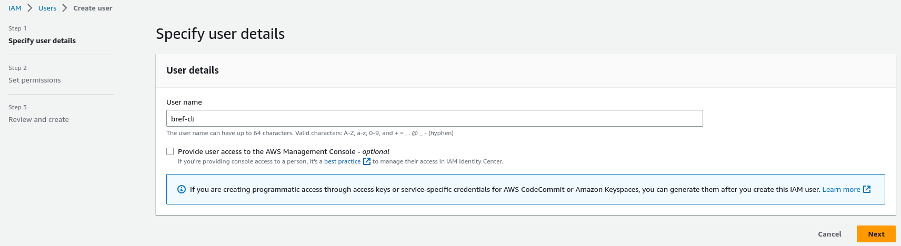

To create AWS access key for Bref and the `serverless` CLI tool follow these steps:

1. In the AWS dashboard, go into IAM and create a new user: [**click here** for a direct link](https://console.aws.amazon.com/iam/home?#/users$new?step=details).

1. Set a user name (for example "bref-cli"), enable **Programmatic access** and move to the next screen.

    

1. Click **Attach existing policies directly**, search for **AdministratorAccess** and select it.

    

    > **WARNING**: the "AdministratorAccess" policy grants full access to your AWS account. This is simpler when starting with AWS and deploying for the first time. However it is highly recommended to restrict permissions further.
    >
    > The Serverless documentation has an example of a configuration with stricter permissions: [read this article to create a more secure policy](https://serverless.com/framework/docs/providers/aws/guide/credentials/#creating-aws-access-keys).

1. Finish creating the user and **note the AWS access keys** that are generated.

[< Back to the installation guide](/docs/installation.md)
