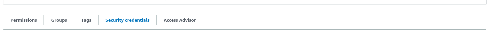
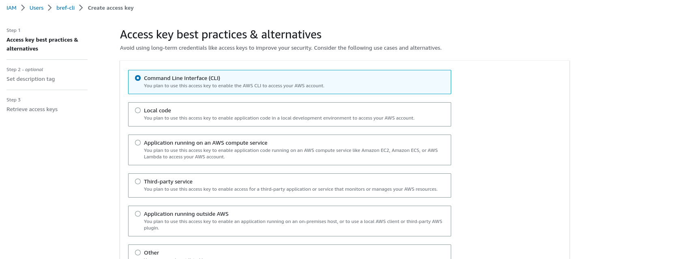
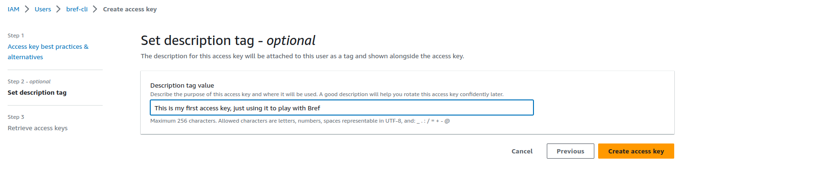

To create AWS access key for Bref and the `serverless` CLI tool follow these steps:

1. In the AWS dashboard, go into IAM and create a new user: [**click here** for a direct link](https://us-east-1.console.aws.amazon.com/iamv2/home#/users/create).

1. Set a user name (for example "bref-cli") and move to the next screen.

    

1. Click **Attach policies directly**, search for **AdministratorAccess** and select it.

    

    > **Warning**: the "AdministratorAccess" policy grants full access to your AWS account. This is simpler when starting with AWS and Bref. However, it is recommended to restrict permissions further eventually.
    >
    > The Serverless documentation has an example of a configuration with stricter permissions: [read this article to create a more secure policy](https://serverless.com/framework/docs/providers/aws/guide/credentials/#creating-aws-access-keys).

1. Finish creating the user.

1. Once your user is created, select it and go to **Security credentials**.

   

1. Scroll down to **Access Keys** and click on **Create access key**.

   

1. Then select **Command Line Interface**.

   

1. Add a description to your access keys and click on **Create access key**.

   

[< Back to the installation guide](/docs/installation.md)
