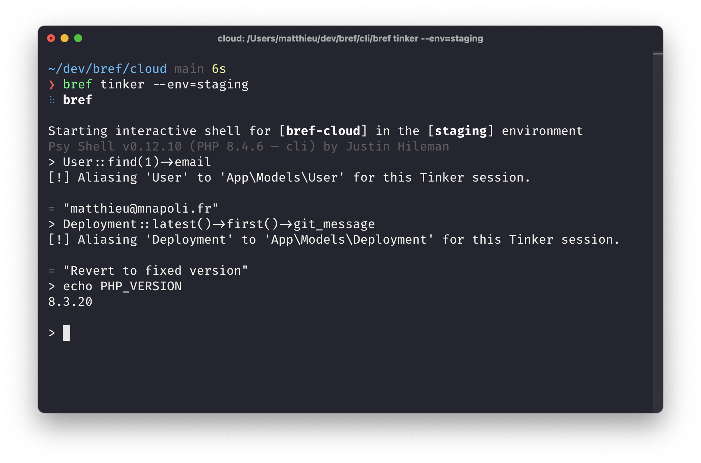

import { Tabs } from 'nextra/components';

# Serverless Laravel - Getting started

This guide helps you run Laravel applications on AWS Lambda using Bref. These instructions are kept up to date to target the latest Laravel version.

> [!TIP]
>
> Coming from Laravel Vapor? Read the [migration guide from Laravel Vapor to Bref](./migrating-from-vapor.mdx).

## Setup

First, **follow the [Setup guide](../setup.mdx)** to create an AWS account and install the necessary tools.

Next, in an existing Laravel project, install Bref and the [Laravel-Bref package](https://github.com/brefphp/laravel-bridge).

```bash
composer require bref/bref bref/laravel-bridge --update-with-dependencies
```

Then let's create a [`serverless.yml` configuration file](../environment/serverless-yml.mdx):

```bash
php artisan vendor:publish --tag=serverless-config
```

### How it works

By default, the Laravel-Bref package will automatically configure Laravel to work on AWS Lambda.

If you are curious, the package will automatically:

- enable the `stderr` log driver, to send logs to CloudWatch ([read more about logs](../environment/logs.mdx))
- enable the [`cookie` session driver](https://laravel.com/docs/session#configuration) (if you prefer, you can configure sessions to be stored in database, DynamoDB or Redis)
- move the storage directory to `/tmp` (because the default storage directory is read-only on Lambda)
- adjust a few more settings ([have a look at the `BrefServiceProvider` for details](https://github.com/brefphp/laravel-bridge/blob/master/src/BrefServiceProvider.php))

## Deployment

We do not want to deploy "dev" caches that were generated on our machine (because paths will be different on AWS Lambda). Let's clear them before deploying:

```bash
php artisan config:clear
```

When running in AWS Lambda, the Laravel application will automatically cache its configuration when booting. You don't need to run `php artisan config:cache` before deploying.

Let's deploy now:

<Tabs items={['Serverless CLI', 'Bref Cloud']}>
    <Tabs.Tab>
        ```bash
        serverless deploy
        ```
    </Tabs.Tab>
    <Tabs.Tab>
        ```bash
        bref deploy
        ```
    </Tabs.Tab>
</Tabs>

When finished, the `deploy` command will show the URL of the application.

### Deploying for production

At the moment, we deployed our local codebase to Lambda. When deploying for production, we don't want to deploy:

- development dependencies,
- our local `.env` file,
- or any other dev artifact.

Follow [the deployment guide](/docs/deploy.md#deploying-for-production) for more details about deploying in general.

> [!WARNING]
>
> Most Laravel applications use `aws/aws-sdk-php` (pulled in by packages like SQS queues, S3 storage, etc.). This package is **very large** (100MB+) and can push your deployment over Lambda's 250MB size limit. Make sure to [remove unused AWS services](/docs/deploy.md#reducing-package-size) to reduce the deployment size.

Specifically for Laravel, Bref will automatically cache the configuration on "cold starts". This means that you don't need to run `php artisan config:cache` before deploying.

> [!NOTE]
>
> You could improve the cold start time by pre-generating the config cache before deploying:
>
> ```bash
> php artisan config:clear && php artisan config:cache
> ```
>
> However Laravel will **hardcode** absolute paths and environment variables in the cached configuration. To deploy a valid cached configuration, you would need to run the commands above in Docker with the application mounted in `/var/task` (the same path as on AWS Lambda), with production environment variables available.
>
> For most applications we do not recommend this approach. Instead, let Bref cache the config in AWS Lambda on cold starts.

### Compiling views before deploying

Laravel compiles Blade views the first time they are rendered. On Lambda, the compiled views are stored in `/tmp`, which is empty after every cold start: each new Lambda instance compiles the views again. To avoid that, compile the views before deploying with `php artisan view:cache`.

The compiled views are written to `storage/framework/views`, and their file names depend on the absolute path of each view. For Lambda to find them, enable `relative_hash` in `config/view.php` (if the file does not exist, create it with `php artisan config:publish view`):

```php filename="config/view.php" {3}
return [
    // ...
    'relative_hash' => true,
];
```

Then compile the views before **every** deployment (in a zip package, outdated compiled views would still be used):

```bash
php artisan view:cache
```

Since `serverless.yml` excludes the `storage` directory, add the compiled views to the deployment:

```yml filename="serverless.yml" {4}
package:
    patterns:
        - '!storage/**'
        - 'storage/framework/views/*.php'
```

If you deploy [container images](../deploy/docker.mdx), compile the views in the `Dockerfile` instead. The application is in `/var/task` there, like on Lambda, so `relative_hash` is not needed:

```dockerfile filename="Dockerfile" {5-6}
FROM bref/php-84:3

COPY . /var/task

# The directory may be excluded by .dockerignore
RUN mkdir -p storage/framework/views && php artisan view:cache
```

Routes and events can also be cached before deploying, with `php artisan route:cache` and `php artisan event:cache`. Avoid `php artisan optimize`: it also caches the configuration (see the note above).

## Troubleshooting

In case your application is showing a blank page after being deployed, [have a look at the logs](../environment/logs.mdx).

## Logs

Thanks to the Bref integration, Laravel will automatically log to CloudWatch via `stderr`. You don't have to do anything.

You can learn more about logs in the [Logs guide](../environment/logs.mdx).

## Website assets

Have a look at the [Website guide](../use-cases/websites.mdx) to learn how to deploy a website with assets.

## Laravel Artisan

As you may have noticed, we define a function named "artisan" in `serverless.yml`. That function is using the [Console runtime](../runtimes/console.mdx), which lets us run Laravel Artisan on AWS Lambda.

For example, to execute an `artisan` command on Lambda, run the command below:

<Tabs items={['Serverless CLI', 'Bref Cloud']}>
    <Tabs.Tab>
        ```bash
        serverless bref:cli --args="{artisan command and options}"
        ```

        For example:

        ```bash
        serverless bref:cli --args="route:list"
        ```
    </Tabs.Tab>
    <Tabs.Tab>
        ```bash
        bref command "{artisan command and options}"
        ```

        For example:

        ```bash
        bref command "route:list --help"
        ```
    </Tabs.Tab>
</Tabs>

For more details follow [the "Console" guide](../runtimes/console.mdx).

### Laravel Tinker

If you are using [Bref Cloud](/cloud), you can start an interactive Tinker shell on AWS Lambda from your machine by running:

```bash
bref tinker
```

The usual flags work, for example to run Tinker in the production environment:

```bash
bref tinker --env=prod
```



> [!TIP]
>
> Make sure to update the `bref/laravel-bridge` package to version 3.0 or higher to use this feature.

If you are not using Bref Cloud, you can check out this community package: [sls-tinker](https://github.com/datpmwork/sls-tinker).

## Inertia

Laravel with Inertia runs without issue, like any other website. Follow the [Websites guide](../use-cases/websites.mdx) to learn how to deploy a Laravel application with assets.
