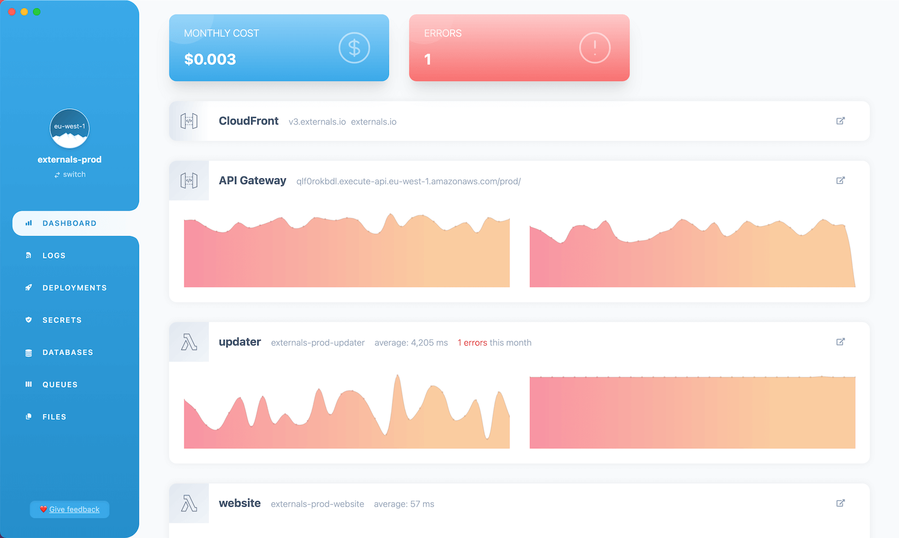
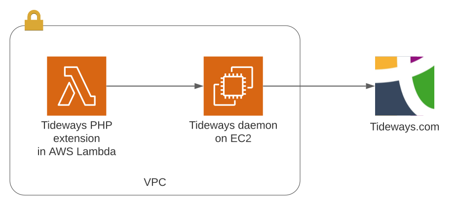

By default, AWS Lambda publishes all logs and general metrics (HTTP response time, code execution duration, etc.) to AWS CloudWatch.

It is possible to view these logs and metrics directly in the [AWS console](https://us-east-1.console.aws.amazon.com/cloudwatch/home?region=us-east-1). However, the CloudWatch UI can be complex and overwhelming.

As an alternative, we can use the [Bref Dashboard](https://dashboard.bref.sh/?ref=bref) to view these logs and metrics. It provides a simpler UI designed for serverless PHP applications.

For advanced metrics and profiling, we can use [Tideways](https://tideways.com/?ref=bref), or [Sentry](https://sentry.io/?ref=bref) if we only want error tracking. Other monitoring tools specialized for distributed serverless applications are also available, like [Epsagon](https://epsagon.com/?ref=bref) or [Thundra](https://www.thundra.io/?ref=bref), but their compatibility with PHP is usually limited. [Serverless.com's Dashboard and Console](https://www.serverless.com/) are not compatible with PHP.

To summarize:

- **General monitoring**: CloudWatch, [Bref Dashboard](https://dashboard.bref.sh/?ref=bref)
- **Advanced monitoring and profiling**: [Tideways](https://tideways.com/?ref=bref)

## Bref Dashboard

As mentioned above, the [Bref Dashboard](https://dashboard.bref.sh/?ref=bref) fetches data from AWS CloudWatch (which is published by default by all serverless applications). As such, it requires no setup in AWS and can be used straight away.

[](https://dashboard.bref.sh/?ref=bref)

## Tideways

> Disclaimer: Tideways is a Bref sponsor ❤️

To use [Tideways](https://tideways.com/?ref=bref) with Bref, we first need to [create a Tideways account](https://app.tideways.io/register/).

Next, we will need to set up two pieces:

- the Tideways PHP extension must be added to the PHP application running on Lambda
- the Tideways daemon must be started in an EC2 server instance

Indeed, the PHP extension runs in the same process as the PHP application and collects traces and advanced metrics. It then sends this data to a Tideways daemon, that will collect it and forward it to tideways.com. That ensures the PHP extension does not add latency to the PHP application.



The connexion between the PHP extension and the daemon needs to be secured. This is why the PHP lambda and the EC2 instance need to run in a VPC (virtual private network), and the EC2 instance should only be reachable from inside the VPC.

### Complete example

The sections below describe how to set up the daemon and PHP extension manually.

Alernatively, you can have a look at a complete and deployable example: [github.com/tideways/bref-tideways-example](https://github.com/tideways/bref-tideways-example). In this example, we deploy the PHP application, the VPC and the daemon in one command via `serverless.yml`.

### Setting up the daemon

Assuming we already have a VPC set up (the [serverless-vpc-plugin](https://github.com/smoketurner/serverless-vpc-plugin) is a good solution to create one), the daemon must be started in the VPC.

1. Open the [Launch instance panel in EC2](https://console.aws.amazon.com/ec2/home#LaunchInstances:)
1. Make sure you are in the correct AWS region
1. Search for `tideways-daemon` in the Community AMI (Amazon Machine Image) catalog
    - If you want more details, [learn more about the Tideways AMI](https://github.com/tideways/tideways-daemon-ami#readme)
1. Select the `t2.micro` instance type as it is the smallest instance and will do the job here
1. Optionally select/create an SSH key pair if you want to SSH into the server later
1. Edit "Network Settings":
    - Select your VPC
    - Select a subnet with outgoing internet access (the daemon needs to reach tideways.io)
        - If you created the VPC, it is usually called a "public" subnet
        - If you are using the default VPC (created by AWS), you can pick any subnet
    - Enable "Auto-assign public IP"
    - Add a "Security group rule" that only allows Lambda functions:
        - Type: "Custom TCP"
        - Port range: `9135` (the port Tideways uses)
        - Source type: "Custom"
        - Source: select the security group used by your AWS Lambda functions (usually called the "AppSecurityGroup" or similar)
1. You can leave the rest of the default settings and create the EC2 instance

Once the daemon has started, copy its "Private IP DNS name", we will use it to configure the PHP application.

### Setting up the PHP application

First, let's install the Tideways PHP extension (it is distributed via the Bref extra extensions):

```bash
composer require bref/extra-php-extensions
```

Edit `serverless.yml` to add the plugin:

```yml
plugins:
    - ./vendor/bref/bref
    # Add this line:
    - ./vendor/bref/extra-php-extensions
```

Edit all your functions to add the Tideways extension layer:

```yml
functions:
    my-function:
        handler: index.php
        layers:
            - ${bref:layer.php-81-fpm}
            # Add this line:
            - ${bref-extra:tideways-php-81}
```

> Make sure to use the same PHP version as the one for the PHP layer.

Next, we can configure the Tideways extension via environment variables:

```yml
provider:
    # ...
    environment:
        # Set your Tideways API key here
        # Read about setting secrets in serverless.yml: https://bref.sh/docs/environment/variables.html#secrets
        TIDEWAYS_APIKEY: '...'
        # Name of the service, used in the Tideways UI
        # https://support.tideways.com/documentation/setup/configuration/services.html
        TIDEWAYS_SERVICE: ${self:service}
        # We point the PHP extension to the Tideways daemon EC2 server
        # Edit the value to use the "Private IP DNS name" of the daemon server
        TIDEWAYS_CONNECTION: 'tcp://<daemon-private-domain-name>:9135'
        # 10% sample rate for the example, adjust to your needs
        # https://support.tideways.com/documentation/setup/configuration/sampling.html
        TIDEWAYS_SAMPLERATE: 10
```

> **Note**:
> 
> The `TIDEWAYS_CONNECTION` variable should contain the "Private IP DNS name" of the Tideways daemon (for example `tcp://ip-172-31-4-74.eu-west-1.compute.internal:9135`). This is the value you retrieved in the previous section.

Don't forget to redeploy the application:

```bash
serverless deploy
```

Metrics for your application should now show up in Tideways.
