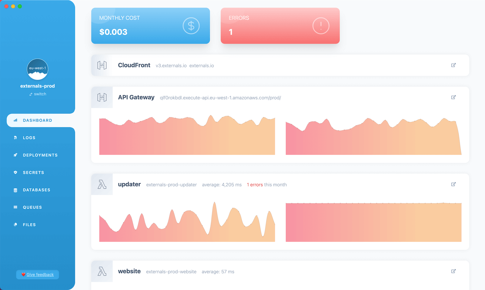

import Image from 'next/image';
import cloudXrayTrace from './cloud-xray-trace.png';
import cloudOverview from './cloud-overview.png';
import cloudLogs from './cloud-logs.png';
import cloudMetrics from './cloud-metrics.png';
import cloudTraces from './cloud-traces.png';
import cloudPerformance from './cloud-performance.png';

# Monitoring

By default, AWS Lambda publishes PHP logs and metrics to [AWS CloudWatch](https://aws.amazon.com/cloudwatch/). These include HTTP response times, code execution duration, error rates, and more.

Here is a summary of recommended tools for monitoring Bref applications:

- **Logs and metrics**: CloudWatch (built-in), [Bref Cloud](/cloud)
- **Error tracking**: [Sentry](https://sentry.io) and similar services
- **Tracing and performance insights**: [Bref Cloud](/cloud) with [X-Ray](/xray)

Let's dive into the details of each of them.

## Sentry

[Sentry](https://sentry.io) is a popular error tracking service. It works well out of the box with Bref for HTTP applications: install the [Sentry SDK for PHP](https://docs.sentry.io/platforms/php/) (or the [Laravel](https://docs.sentry.io/platforms/php/guides/laravel/) or [Symfony](https://docs.sentry.io/platforms/php/guides/symfony/) integrations) and errors will be tracked automatically.

For more advanced use cases, such as tracking Lambda errors outside of PHP-FPM (timeouts, oversized responses…), monitoring event-driven handlers (SQS, EventBridge, S3…), or tracking cold starts and AWS SDK calls, the [Bref Sentry package](/sentry) extends Sentry's capabilities for AWS Lambda. It is available as a [separate license](/sentry).

## Bref Cloud

[Bref Cloud](/cloud) monitors serverless PHP applications. It reads logs, metrics and traces from your AWS account. There is no agent to install.

### Overview

The overview page shows a diagram of the environment: Lambda functions, API Gateway, CloudFront, SQS queues, S3 buckets and databases. Each component shows live metrics: requests, invocations, errors, queue size, storage.

<Image className="mt-3 rounded-lg shadow-md border" src={cloudOverview} alt="Bref Cloud application overview" />

### Logs

View, search and tail CloudWatch logs. Laravel and Symfony logs are [structured](/docs/environment/logs): you can filter them by log level or exception class.

<Image className="mt-3 rounded-lg shadow-md border" src={cloudLogs} alt="Log viewer in Bref Cloud" />

### Metrics

The metrics page shows Lambda invocations, duration and errors, as well as API Gateway requests and latency. Queue metrics can also be found in the "Queues" page. You can add graphs to compare metrics over up to 30 days.

<Image className="mt-3 rounded-lg shadow-md border" src={cloudMetrics} alt="Metrics in Bref Cloud" />

### Traces

A trace shows what happens inside an invocation: PHP code, database queries, HTTP calls, and AWS SDK calls. For each AWS call, the trace shows the queue, table, or topic it used.

<Image className="mt-3 rounded-lg shadow-md border" src={cloudXrayTrace} alt="X-Ray trace in Bref Cloud" />

The [Bref X-Ray package](/xray) adds annotations to traces: route, controller, job class, CLI command, cold start. You can add [your own annotations](/xray/docs#custom-annotations), for example the tenant or the plan of the user. The trace explorer uses annotations as filters. For example, you can list all the traces of one route, of one job, of one tenant, or all the invocations with a cold start.

<Image className="mt-3 rounded-lg shadow-md border" src={cloudTraces} alt="Trace explorer in Bref Cloud" />

Enable [AWS Transaction Search](/xray/docs#enabling-aws-transaction-search) on your AWS account, and the trace explorer searches up to 30 days of traces instead of 6 hours. It is a one-time switch in the AWS console.

### Performance

The Performance page aggregates the traces of the last 30 days. It shows the slowest database queries, the latency of each route, and the slowest jobs.

<Image className="mt-3 rounded-lg shadow-md border" src={cloudPerformance} alt="Performance page in Bref Cloud" />

- **Slowest database queries**: SQL queries grouped by statement, with the number of calls, the average duration and the p95 duration.
- **Routes**: server-side processing time per route, sorted by number of requests or by latency. Click a route to open its traces.
- **Slowest jobs**: queue worker invocations grouped by job class. Click a job to open its traces.

The page requires the [Bref X-Ray package](/xray) in the application and [Transaction Search](/xray/docs#enabling-aws-transaction-search) on the AWS account. After that, there is nothing else to configure. Bref Cloud computes the statistics when you open the page, caches them for 24 hours, and lets you recompute them at any time. The statistics only include traced invocations (see the [X-Ray sampling rate](/xray/docs#costs)).

### Failed jobs and health checks

Laravel applications have a "Failed jobs" tab next to their queues. It shows the exception of each failed job. You can retry, delete or flush jobs from there.

Health checks check that a deployed application works: the database is reachable, the cache works, the Lambda functions use the recommended settings. Laravel only for now.

### X-Ray license

Bref Cloud paid plans include a free [Bref X-Ray](/xray) license. To activate it, contact support via [bref.cloud/support](https://bref.cloud/support) or [Slack](https://bref.sh/slack).

[Learn more about Bref Cloud](/cloud).

## X-Ray

[AWS X-Ray](https://aws.amazon.com/xray/) provides distributed tracing for Lambda applications. The [Bref X-Ray package](/xray) integrates X-Ray with PHP, tracking cold starts, database queries, HTTP calls, AWS SDK calls, and more. It supports both Laravel and Symfony.

The package can be used with or without Bref Cloud. Bref Cloud users get a free license (see above), while others can [purchase a standalone license](/xray).

## Sentry Lambda package

As mentioned above, the standard Sentry SDK works great for HTTP applications. The [Bref Sentry package](/sentry) goes further by adding Lambda-specific capabilities: tracking errors outside of PHP-FPM, monitoring event-driven handlers, and tracking cold starts.

The package can be used with or without Bref Cloud. It is available as a [standalone license](/sentry).

## Bref Dashboard

The [Bref Dashboard](https://dashboard.bref.sh/?ref=bref) is an alternative for projects that do not use Bref Cloud. It fetches data from AWS CloudWatch and provides a simple UI for logs and metrics. It requires no setup in AWS and can be used straight away.

## Tideways

[Tideways](https://tideways.com/?ref=bref) is a PHP-specific monitoring and profiling tool that can be used with Bref. It requires setting up a daemon on an EC2 instance in a VPC.

[Learn more about using Tideways with Bref](./monitoring/tideways.md).
