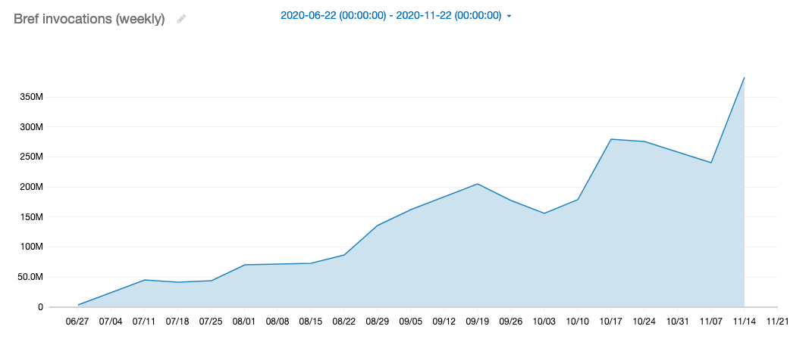
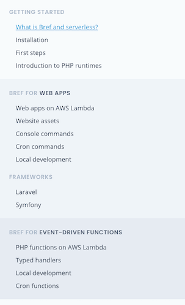

Bref started in November 2017, 3 years ago. Back then, running PHP on AWS Lambda was experimental at best.

Over the years, as the Bref community grew, as AWS features landed, and as contributors worked, creating serverless PHP applications has become a reality. Bref 0.2 has seen 37 releases. Bref 0.5 has 33. In total, we've released 89 versions since the project started.

Needless to say, **Bref is stable** and has been for a long time.

<div class="text-xl my-8">
    Indeed, Bref runs more than 1 billion requests and jobs every month!
</div>

"Serverless PHP" is no longer a niche, and running scalable PHP applications has never been simpler.

To celebrate, we're finally releasing **Bref 1.0**!

## 1 billion executions per month

Thanks to [Bref ping](/docs/runtimes/#bref-ping), we have an anonymous estimate of Bref's usage, i.e. the number of monthly invocations (HTTP requests, worker jobs, etc.) across all users.

It illustrates clearly that Bref is getting traction and is used in production, at scale:



Since we passed 1 billion monthly invocations, I want to celebrate with you this fantastic milestone and thank you for being a part of Bref's community.

## Bref 1.0

Enough with the fun stuff, what's new?

- [**Lighter Lambda runtimes**](#lighter-runtimes) by moving some extensions to an extra layer instead of embedding them by default.
- [**Migration to Amazon Linux 2**](#amazon-linux-2), which will be required by AWS Lambda at the end of the year.
- [**Huge documentation improvements**](#documentation-improvements): a search bar, a reorganization, documentation of _typed handlers_, updates all over the place, and a better onboarding experience.
- [**New `vendor/bin/bref local` command**](#run-functions-locally) to run functions locally.
- [**New projects will use API Gateway v2**](#api-gateway-v2) because they are simpler, cheaper, and faster.

What did we break? **Nothing major**, the upgrade should be smooth. Here are the details:

- PHP 7.2 is no longer supported. PHP 7.3 still is.
- GD, Imagick, Redis, MongoDB extensions are no longer installed by default; you need to include them via [Bref extra extensions](https://github.com/brefphp/extra-php-extensions).
- PHP is now compiled without ZTS (thread safety).
- Removed the deprecated `lambda()` function.
- Removed deprecated `vendor/bin/bref` commands:
  - `vendor/bin/bref invoke` is replaced by `serverless invoke`.
  - `vendor/bin/bref deployment` has become useless.
  - `vendor/bin/bref bref.dev` has become useless.

## Lighter runtimes

[Sébastien Houzé](https://github.com/shouze) has worked to make the Bref runtimes (AWS Lambda layers) lighter.
One solution we went with was to remove built-in extensions that were not commonly used in most applications:

- GD
- Imagick
- Redis
- MongoDB

By removing them, we make your Lambda lighter, leaving more room for your code and improving cold start performances.

Of course, we don't want to simply _remove_ those extensions.
That's why they've been moved to separate layers in the [Bref extra extensions](https://github.com/brefphp/extra-php-extensions) repository, carefully maintained by [Tobias Nyholm](https://github.com/Nyholm).

For example, to install imagick (via `serverless.yml`):

```yaml
functions:
    myapp:
        handler: public/index.php
        layers:
            - ${bref:layer.php-74-fpm}
            - ${bref:extra.imagick-php-74}
```

## Amazon Linux 2

AWS [introduced a new base Linux image](https://aws.amazon.com/blogs/compute/migrating-aws-lambda-functions-to-al2/) for Lambda. We need to upgrade our applications to use it.

Thanks again to [Sébastien Houzé](https://github.com/shouze), Bref 1.0 will work with Amazon Linux 2.
Upgrading is as simple as changing this line in `serverless.yml`:

```diff
provider:
    name: aws
-    runtime: provided
+    runtime: provided.al2
```

Remember to upgrade to Bref 1.0 first!

## Documentation improvements

"Documentation improvements" sounds boring, but I'm extremely happy with this for many reasons:

- onboarding new users now makes much more sense,
- current users can troubleshoot and improve their knowledge of Bref and serverless,
- expert users can now dig in deeper, especially with "typed handlers".

### Onboarding for new users

New users now start with the _FPM_ runtime.

Don't worry about FaaS and functions… Start by running **PHP as usual** on a cheap and scalable host. Then, **once you've had your first success**, you can look into the "Function runtime" and its power.

Check out [the "First steps" guide and see how simple it is!](/docs/first-steps.md).

### Clarity for current users

A common source of errors and confusion was the two runtimes: "FPM" and "Function".

To solve that, we clarified the wording and the structure of the documentation:

- [**Bref for web apps**](/docs/runtimes/http.md) lets you run Laravel, Symfony, etc. on Lambda like on any server, using PHP-FPM (aka the "FPM" runtime),
- [**Bref for event-driven functions**](/docs/runtimes/function.md) lets you handle native AWS Lambda events (aka the "Function" runtime).

*Bref for web apps* is the default runtime (see the "onboarding" section above), so if you're not sure: go with this one.

[](/docs/runtimes/)

### More for expert users

Creating event-driven functions to handle Lambda events can be done using anonymous functions:

```php
return function ($event) {
    return 'Hello ' . $event['name'];
};
```

But for months now, you can also create fully typed handler classes instead.
This is now documented in the [**Typed PHP Lambda handlers**](/docs/function/handlers.md) page.

You can now write asynchronous workers to process SQS queues, process uploaded files via S3 events, create decoupled microservices using EventBridge, etc.
Well, you already could, but now it will be a bit easier.

> Self-promotion time: I've helped enterprises refactor their microservice architectures using Lambda and SQS/EventBridge.
If you are interested, [get in touch to work together](mailto:matthieu@null.tc).
You can also check out [Serverless Visually Explained](https://serverless-visually-explained.com/), it contains examples for those use cases.
</self-promo\>

Finally, the [`BREF_LOOP_MAX` variable](/docs/environment/performances.md#bref-for-event-driven-functions) is now documented, for those ready to keep the PHP process alive between events to accelerate their workers.

### Redesigning the header

The website has been slightly redesigned:

- a top menu bar has been introduced, to easily navigate between the home, documentation, news and GitHub repository,
- a **search field** has been introduced 🎉

Thanks to [Algolia DocSearch](https://docsearch.algolia.com/) for providing the search engine!

## Run functions locally

Bref provides Docker images to run *web apps* locally (e.g. Laravel or Symfony) and that works well.

However, when creating event-driven functions, running them locally via `serverless` and Docker was slow and unstable.

Bref 1.0 introduces a new command:

```bash
$ vendor/bin/bref local hello
Hello world

# With JSON event data
$ vendor/bin/bref local hello '{"name": "Jane"}'
Hello Jane
```

What's awesome is that you decide if you want to use Docker or not (with the Bref images). You can skip Docker for best performances and ease of use, or use Docker to run in an environment that replicates production.

Read more in the documentation: [Local development for functions](/docs/function/local-development.md).

## API Gateway v2

API Gateway offers two versions:

- v1's REST API
- v2's HTTP API

Bref switches from REST API to HTTP API. Why:

- HTTP API has lower latency (it's slightly faster)
- HTTP API [is 70% cheaper](https://aws.amazon.com/blogs/compute/announcing-http-apis-for-amazon-api-gateway/)
- HTTP API is simpler to configure, both in the AWS console and `serverless.yml`
- HTTP API **do not have the `/dev/` prefix in URLs!**

The last point was a huge pain in the onboarding experience: links and redirects were broken in Symfony and Laravel.
This will no longer be the case 💪

HTTP API offers mostly advantages, which is why Bref's documentation and templates have changed to use the new version.

To update your existing projects, it's only 2 lines to change in `serverless.yml`:

```diff
functions:
    website:
        # ...
        events:
-            - http: 'ANY /'
-            - http: 'ANY /{proxy+}'
+            - httpApi: '*'
```

**However don't do this blindly:** this will delete your REST API to create a new HTTP API, which will break custom domains you may have set up.
Instead, you can deploy the same Lambda with both v1 and v2, [set up your domain on v2](/docs/environment/custom-domains.md), and then delete v1:

```yaml
functions:
    website:
        # ...
        events:
            - http: 'ANY /'
            - http: 'ANY /{proxy+}'
            - httpApi: '*'
```

## Upgrading breaking changes

The deprecated `lambda()` function has been removed. If you were defining Lambda handlers with it, remove the call to the function. For example:

```php
// Before
return lambda(function (array $event) {
    return 'Hello ' . $event['name'];
});

// After
return function (array $event) {
    return 'Hello ' . $event['name'];
};
```

The deprecated `$_SERVER['LAMBDA_CONTEXT']` has been removed in favor of `$_SERVER['LAMBDA_REQUEST_CONTEXT']` (same content).

## Thanks

A huge thanks to the [100 Bref contributors](https://github.com/brefphp/bref/graphs/contributors), to the community for supporting the project, and to those sponsoring the development:

- [Null](https://null.tc/)
- [GeckoEngage](https://geckoengage.com/)
- [Laravel](https://laravel.com/)
- [JetBrains](https://www.jetbrains.com/)
- [Twilio](https://www.twilio.com/)

and [many others](https://github.com/sponsors/mnapoli#sponsors). Thank you all!

## That's it!

Hope you enjoy it! And stay tuned for the AWS re:Invent conference next week!

You can also join the community [in Slack](/docs/community.md), post details about your project in [Built with Bref](https://github.com/brefphp/bref/issues/267) or share your experience online.

<div class="grid grid-cols-1 md:grid-cols-2 gap-4 mt-6">
    <a href="/docs/" class="rounded-md shadow px-8 py-8 border text-center font-bold hover:bg-gray-100">What is Bref and serverless?</a>
    <a href="/docs/first-steps.html" class="rounded-md shadow px-8 py-8 border text-center font-bold hover:bg-gray-100">Get started with Bref</a>
</div>
