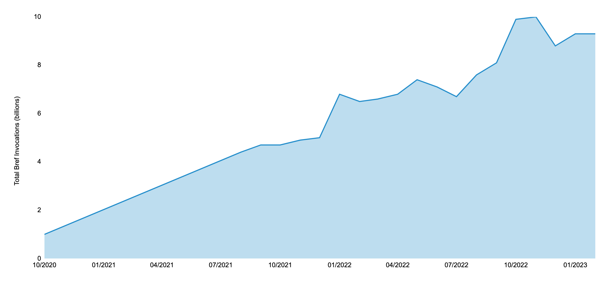
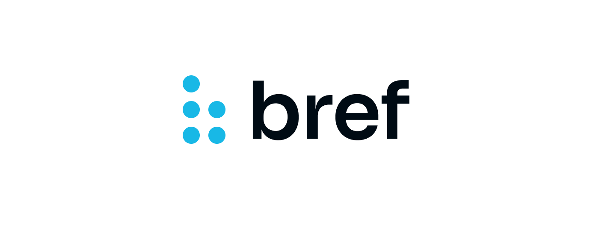

The work on what would be Bref 2.0 started in October 2021, about 1.5 year ago. We went through many different strategies, experiments, rewrites, over **700 commits** to finally land with the stable release.

So far, Bref has been installed more than 2 million times and powers more than **10 billion Lambda executions** (aka requests) every month[*](https://bref.sh/docs/runtimes/#bref-ping).

That's [1 in every 1000 AWS Lambda executions](https://twitter.com/matthieunapoli/status/1603032544424894464)!



Today, we celebrate these achievements, the ongoing work, and **the release of Bref 2.0** 🎉

Let's check out what's new in v2.

## Bref 2.0

Here's a summary, we'll dive in the details below:

- Simpler `serverless.yml` configuration for setting up PHP.
- Revamped Laravel integration.
- ARM/Graviton support (faster processors with lower Lambda costs).
- Faster deployments by default.
- `vendor/bin/bref cli` becomes much simpler.
- Automatically load secrets in environment variables at runtime.
- Simpler `docker-compose.yml` for local development.
- PHP constructs for AWS CDK support.
- The internals (the scripts that build the runtime) have been rewritten at least 4 times ([just look at the number of commits on the v2 runtimes…](https://github.com/brefphp/aws-lambda-layers)) but they are much better now: they are now tested, we understand all the code, we optimized their size, we've made the builds as fast as possible, and contributions and maintenance as easy as possible.

What did we break? **Nothing major**, the upgrade should be smooth. Here are the details:

- PHP 8.0+ is now required (7.4 support is dropped).
- Serverless Framework v3 is now required (2.x is obsolete). Run `serverless --version` to check.
- The `vendor/bin/bref` commands have been moved to the `serverless` CLI (detailed below).
- If you have a `docker-compose.yml` for local development, it needs to be adjusted (detailed below).
- The `separateVendor` option in `serverless.yml` has been removed (unmaintained feature).

## Simpler runtime configuration

Bref 2.0 lets us configure the runtime and PHP version in a much simpler way in `serverless.yml` ([#1394](https://github.com/brefphp/bref/pull/1394)). Here's an example below.

Note: **this new feature is optional**, you can keep using the Bref v1 syntax as it still works (this is not a breaking change).

Before (Bref v1 syntax):

```yaml
provider:
    name: aws
    runtime: provided.al2
functions:
    api:
        handler: public/index.php
        # ...
        layers:
            - ${bref:layer.php-81-fpm}
```

After (Bref v2 syntax):

```yaml
provider:
    name: aws
functions:
    api:
        handler: public/index.php
        # ...
        runtime: php-81-fpm
```

As you can see, we no longer have to set `runtime: provided.al2` and add the Bref layers. We can now directly set a PHP runtime (`php-81`, `php-81-fpm`, `php-81-console`) and Bref will transform this into the proper runtime + layers configuration.

This works for all the Bref runtimes ([FPM](https://bref.sh/docs/runtimes/http.html), [function](https://bref.sh/docs/runtimes/function.html) and [console](https://bref.sh/docs/runtimes/console.html)) and all supported PHP versions (`80`, `81`, and `82` at the moment). Here's a recap:

```yaml
# PHP-FPM runtime (web apps)
runtime: provided.al2
layers:
    - ${bref:layer.php-81-fpm}
# becomes:
runtime: php-81-fpm

# Function runtime
runtime: provided.al2
layers:
    - ${bref:layer.php-81}
# becomes:
runtime: php-81

# Console runtime
runtime: provided.al2
layers:
    - ${bref:layer.php-81}
    - ${bref:layer.console}
# becomes:
runtime: php-81-console
```

The Bref documentation has been updated to reflect these changes.

## New Laravel integration

Bref provides the [Laravel bridge](https://github.com/brefphp/laravel-bridge) to easily deploy Laravel applications to AWS Lambda.

However, that bridge was lagging behind and was limited in some features. The community ([CacheWerk](https://cachewerk.com/), [Till Kruss](https://github.com/tillkruss), and [George Boot](https://github.com/georgeboot)) maintained a better alternative at [cachewerk/bref-laravel-bridge](https://github.com/cachewerk/bref-laravel-bridge).

With Bref 2.0, we are joining forces and their bridge will become the new Bref Laravel bridge ([#94](https://github.com/brefphp/laravel-bridge/pull/94))!

The package name will stay `bref/laravel-bridge`, but a new major version (2.0) has been published with these improvements:

- Laravel Octane support!
- Automatic config caching (if not already cached) on Lambda cold start.
- Maintenance mode.
- Storage directory moved entirely to `/tmp`.
- AWS credentials automatically set up for S3 disks, SQS queues, and DynamoDB caches.
- and more minor changes, see [#94](https://github.com/brefphp/laravel-bridge/pull/94).

More importantly, it **improves how Laravel Queues are supported** (this is the most significant breaking change):

- Laravel bridge 1.x adapted Laravel Queues to SQS: the retry strategy and storing of failed messages was handled by SQS (configured in `serverless.yml`). All SQS features were supported, but only a fraction of Laravel Queues features were supported.
- Laravel bridge 2.0 follows the official behavior of Laravel Queues instead. Only a fraction of SQS features are supported, but **all** features of Laravel Queues are now supported (e.g. job retry, delay, rate limiting, storing failed messages…).

That should make the experience for Laravel users much simpler, as existing projects can be ported to Lambda with no changes.

_Note that it is possible to stay on the 1.x version of the Laravel bridge._

Let's take the opportunity to send huge thanks to Till and George for building such an excellent integration, and for joining the Bref organization on GitHub 💙

If you want to get started with Laravel on Bref, [check out the documentation](../frameworks/laravel.md).

## ARM/Graviton support

Since 2021, it is possible to deploy Lambda functions [running on ARM processors](https://aws.amazon.com/blogs/aws/aws-lambda-functions-powered-by-aws-graviton2-processor-run-your-functions-on-arm-and-get-up-to-34-better-price-performance/) (called Graviton) instead of Intel x86 processors. However, Bref did not support that.

These processors usually run applications faster ([example here](https://twitter.com/matthieunapoli/status/1605583651659345921)), and ARM functions [cost 20% less](https://aws.amazon.com/lambda/pricing/).

With Bref v2, we can deploy on ARM by setting the `architecture` field to `arm64`:

```yaml
provider:
    # ...
    architecture: arm64
functions:
    # ...
```

The `architecture: arm64` field can also be set [in each function individually](https://www.serverless.com/framework/docs/providers/aws/guide/functions#instruction-set-architecture).

**Warning:** the example above uses the new `runtime: php-xx` syntax introduced above. If you set `layers` instead, you will need to set `architecture: arm64` **and** update layers to reference ARM layers:

```yaml
provider:
    # ...
    architecture: arm64
functions:
    api:
        # ...
        layers:
            # Add the `-arm` prefix in layers 👇
            - ${bref:layer.arm-php-81-fpm}
```

## Faster deployments

There is a `serverless.yml` option [to enable faster deployments](https://www.serverless.com/framework/docs/providers/aws/guide/deploying#deployment-method):

```yaml
provider:
    # ...
    deploymentMethod: direct
```

In Bref v2, this option is enabled by default ([#1395](https://github.com/brefphp/bref/pull/1395)). If the option was already set in your `serverless.yml`, you can remove it (or leave it). If it wasn't, your deployments should be about twice faster.

## Simpler CLI commands

Using Bref means using 2 different CLIs:

- `vendor/bin/bref`
- `serverless`

With Bref v2, all commands (except `vendor/bin/bref init`) have been moved to the `serverless` CLI ([#1303](https://github.com/brefphp/bref/pull/1303)). Besides reducing confusion, integrating in the `serverless` CLI lets us re-use the same AWS credentials, region, stack names, function names, etc. It makes the commands simpler.

Here are the commands that have changed:

- `vendor/bin/bref cli` is replaced by the simpler `serverless bref:cli`.
 
  For example:
  
  ```bash
  vendor/bin/bref cli mystack-dev-artisan --region=eu-west-1 -- migrate --force
  # becomes:
  serverless bref:cli --args="migrate --force"
  ```
  
  No need to provide the function name or the region anymore. Read [the Console documentation](../runtimes/console.md#usage) to learn more. You will also find alternatives if you don't use the `serverless` CLI.

- `vendor/bin/bref local` is replaced by the simpler `serverless bref:local`.

  For example:

  ```bash
  vendor/bin/bref local --handler=my-handler.php
  # becomes:
  serverless bref:local -f hello
  ```
  
  No need to provide the handler file name anymore, we directly use the function name. The new `serverless bref:local` command has similar arguments as `serverless invoke`.

  Read [the Local Development documentation](../function/local-development.md) to learn more. You will also find alternatives if you don't use the `serverless` CLI.

- `vendor/bin/bref layers` is replaced by the simpler `serverless layers`.

  Layer versions are also available at [runtimes.bref.sh](https://runtimes.bref.sh/) if you don't use the `serverless` CLI.

These changes allowed us to simplify the commands (automatically use the AWS region, credentials and stage from the `serverless` CLI). It also allowed us to remove the biggest `bref/bref` Composer dependencies and make the package much lighter.

## Automatically load secrets in Lambda

Bref v1 lets you inject secrets (API keys, DB passwords, etc.) stored in SSM into environment variables **at deployment time**:

```yaml
provider:
    # ...
    environment:
        GITHUB_TOKEN: ${ssm:/my-app/github-token}
```

This relies on `serverless.yml` variables ([`${ssm:xxx}`](https://www.serverless.com/framework/docs/providers/aws/guide/variables#reference-variables-using-the-ssm-parameter-store)) and works well, however the drawbacks are:

- The secret value is retrieved on `serverless deploy` and set in plain text in the environment variable.
- The user that runs `serverless deploy` must have permissions to retrieve the secret value.

In Bref v2, you can have these secrets injected **at runtime** (when your code boots in Lambda) via a new syntax ([#1376](https://github.com/brefphp/bref/pull/1376)):

```yaml
provider:
    # ...
    environment:
        # Different syntax that does NOT start with `$`
        GITHUB_TOKEN: bref-ssm:/my-app/github-token
```

In the example above, `GITHUB_TOKEN` will be deployed with the string `bref-ssm:/my-app/github-token` (i.e. it doesn't contain the secret). When Lambda starts, Bref will automatically retrieve the secret and **replace** the environment variable value. No changes needed in your code.

This offers a more secure solution for teams that prefer to keep secrets as tight as possible.

Read more about this new feature and secrets in general in the [Secrets documentation](../environment/variables.md#at-runtime).

## Simpler `docker-compose.yml` for local development

Running HTTP applications locally with Bref Docker images got simpler ([#38](https://github.com/brefphp/aws-lambda-layers/pull/38)). If you used them in `docker-compose.yml`, you will need to update it.

Before (Bref v1):

```yaml
services:

    web:
        image: bref/fpm-dev-gateway
        ports:
            - '8000:80'
        volumes:
            - .:/var/task
        depends_on:
            - php
        environment:
            HANDLER: public/index.php
            DOCUMENT_ROOT: public

    app:
        image: bref/php-80-fpm-dev
        volumes:
            - .:/var/task

    console:
        image: bref/php-80
        volumes:
            - .:/var/task
        entrypoint: php
```

After (Bref v2):

```yaml
services:
    app:
        image: bref/php-80-fpm-dev
        ports: [ '8000:8000' ]
        volumes:
            - .:/var/task
        environment:
            HANDLER: public/index.php
            DOCUMENT_ROOT: public
```

The `bref/php-XX-fpm-dev` images can now run HTTP applications, console commands as well as event-driven functions too. Read more in [web app local development](../web-apps/local-development.md).

The `bref/fpm-dev-gateway` image is no longer needed, and code running in `bref/php-XX-fpm-dev` now runs in an environment even closer to production.

## PHP constructs for AWS CDK support

[AWS CDK](https://docs.aws.amazon.com/cdk/v2/guide/home.html) is a deployment tool that can be used as an alternative to `serverless.yml`.

Bref 2.0 introduces basic support for the AWS CDK (NodeJS) via [PHP constructs](https://github.com/brefphp/constructs).

In case you are not familiar with it, AWS CDK is bit more complex than `serverless.yml` to deploy serverless apps. These constructs will be useful to those actively looking to use the CDK with Bref.

## Rewritten internals

The scripts that build the AWS Lambda runtimes and Docker images have been completely rewritten at least 4 times ([just look at the number of commits on the v2 runtimes…](https://github.com/brefphp/aws-lambda-layers)). These scripts have also been moved to a separate repository: [brefphp/aws-lambda-layers](https://github.com/brefphp/aws-lambda-layers).

The internals are in a much better place now:

- We have way more test coverage.
- We optimized the runtime sizes.
- We optimized the build speed.
- We documented as much as possible.
- We now understand 99% of the build scripts (compared to ~50% before, yes I'm not joking).

Besides making maintenance and contributions much simpler, these changes allowed us to support ARM Lambda functions.

I want to extend a huge thanks to [Depot](https://depot.dev/) for sponsoring the project and [making our Docker builds 10 to 20 times faster](https://twitter.com/matthieunapoli/status/1620090744408244224)!

I know this isn't _that_ exciting, but I had to mention it given the incredible effort put into this over the last 1.5 years.

## Thanks

A huge thanks to the [136 Bref contributors](https://github.com/brefphp/bref/graphs/contributors), to the community for supporting the project, and to the open-source sponsors:

<div class="mt-8 mb-4 pt-8 pb-6 border-t border-gray-300 flex-grow grid grid-cols-3 md:grid-cols-5 gap-x-8 gap-y-12">
    <a class="flex justify-center items-center" href="https://aws.amazon.com" title="AWS">
        
    </a>
    <a class="flex justify-center items-start" href="https://craftcms.com/?ref=bref.sh" title="Craft CMS">
        
    </a>
    <a class="flex justify-center" href="https://tideways.com/?ref=bref" title="Tideways">
        
    </a>
    <a class="flex justify-center items-center" href="https://www.mybuilder.com/?ref=bref.sh" title="MyBuilder">
        
    </a>
    <a class="-mt-3 flex justify-center" href="https://null.tc/?ref=bref" title="Serverless consulting company">
        
    </a>
</div>
<div class="my-4 py-8 border-t border-b border-gray-300 flex-grow grid grid-cols-3 md:grid-cols-5 gap-x-8 gap-y-12">
    <a class="flex justify-center -mt-2 -mb-4" href="https://www.jetbrains.com/?ref=bref.sh" title="JetBrains - Makers of PhpStorm">
        
    </a>
    <a class="flex justify-center items-center" href="https://laravel.com/?ref=bref.sh" title="Laravel">
        
    </a>
    <a class="flex justify-center items-center" href="https://depot.dev/?ref=bref.sh" title="Depot">
        
    </a>
    <a class="flex justify-center items-center" href="https://secumailer.com/?ref=bref.sh" title="SecuMailer">
        
    </a>
    <a class="flex justify-center items-center" href="https://www.kartenmacherei.de/?ref=bref.sh" title="Karten Macherei">
        
    </a>
    <a class="flex justify-center items-center" href="https://ecomail.cz/?ref=bref.sh" title="Ecomail.cz">
        
    </a>
    <a class="flex justify-center items-center" href="https://akaunting.com/?ref=bref.sh" title="Akaunting - Free Accounting Software">
        
    </a>
</div>

and [many others](https://github.com/sponsors/mnapoli#sponsors) (shout out to [@GensDeConfiance](https://twitter.com/GensDeConfiance) for the one-time sponsorship today).

A huge thank you to all contributors that have helped to maintain v1 and/or with this huge upcoming release, including [@deleugpn](https://github.com/deleugpn) who rewrote most of the Lambda runtimes, [@GrahamCampbell](https://github.com/GrahamCampbell) who is helping to keep the runtimes up to date, [@t-richard](https://github.com/t-richard) and [@afu-dev](https://github.com/afu-dev) who have been extremely helpful on the Symfony integration and in the community, [@Nyholm](https://github.com/Nyholm) who has been maintaining flawlessly the Bref Extra extensions, [@mykiwi](https://github.com/mykiwi) for keeping PHP up to date, [@shouze](https://github.com/shouze) who is helping on layers and extra extensions, [@georgeboot](https://github.com/georgeboot) who is contributing amazing ideas on the Laravel integrations, [@tillkruss](https://github.com/tillkruss) who is pushing what Bref could be for Laravel users, and so many more ([@shadowhand](https://github.com/shadowhand), [@kevincerro](https://github.com/kevincerro), [@Guillaume-Rossignol](https://github.com/Guillaume-Rossignol), [@nealio82](https://github.com/nealio82)…).

Thank you all!

## That's it!

Hope you enjoy Bref v2!

There is a complete [**v2 Upgrade Guide**](../upgrading/v2.md) that you can follow.

Head to the docs to [**get started with Bref**](../), or check out the documentation for [Laravel](../frameworks/laravel.md) or [Symfony](../frameworks/symfony.md).

You can also join the community [in Slack](/docs/community.md), post details about your project in [Built with Bref](https://github.com/brefphp/bref/issues/267), or share your experience online and mention [@brefphp](https://twitter.com/brefphp) on Twitter.

If you enjoy teasers, here is a preview of a redesign coming soon to Bref:

<div class="flex justify-center"></div>

## One more thing

I launched the [**Bref Dashboard**](https://dashboard.bref.sh/) ✨ in January. It helps you monitor and debug Bref applications:

[](https://dashboard.bref.sh/?ref=bref)

And if you need support or help going serverless, check out the [Support Plans](/#ecosystem).

<div class="grid grid-cols-1 md:grid-cols-2 gap-4 mt-6">
    <a href="/docs/" class="rounded-md shadow px-8 py-8 border text-center font-bold hover:bg-gray-100">What is Bref and serverless?</a>
    <a href="/docs/first-steps.html" class="rounded-md shadow px-8 py-8 border text-center font-bold hover:bg-gray-100">Get started with Bref</a>
</div>
