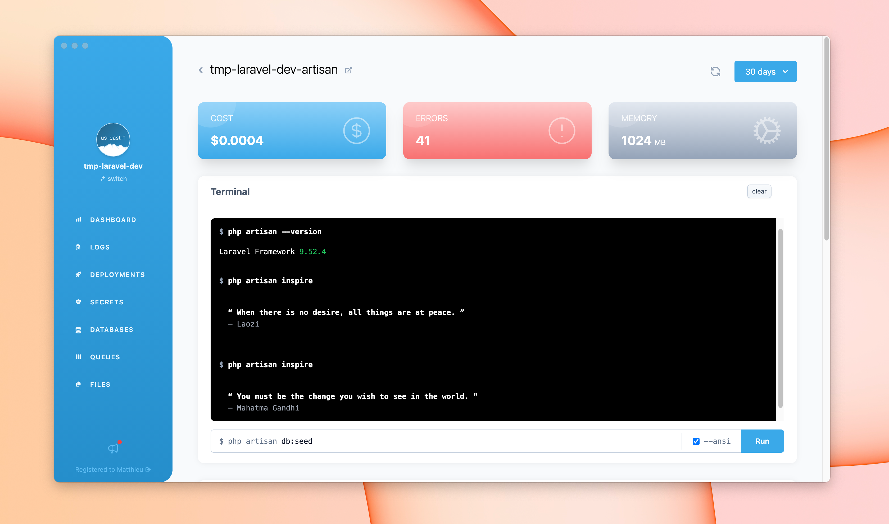

Bref provides a way to run console commands on AWS Lambda.

This can be used to run PHP scripts, the [Symfony Console](https://symfony.com/doc/current/console.html), as well as [Laravel Artisan](https://laravel.com/docs/artisan) commands in production.

## Configuration

The lambda function used for running console applications must use the `php-xx-console` runtime. Here is an example `serverless.yml`:

```yaml
service: app
provider:
    name: aws
plugins:
    - ./vendor/bref/bref
functions:
    hello:
        handler: bin/console # or 'artisan' for Laravel
        runtime: php-81-console
```

Behind the scenes, the `php-xx-console` runtime will deploy a Lambda function configured to use Bref's `php-81` AWS Lambda layer plus Bref's `console` layer (read more about these in the [runtimes documentation](./README.md)).

## Usage

To run a console command on AWS Lambda, run `serverless bref:cli` on your computer:

```bash
serverless bref:cli --args="<command to run in lambda>"
```

The `bref:cli` command will automatically detect which function (in `serverless.yml`) uses the `console` runtime and will run the command on that function.

Pass your command arguments and options in the `--args` flag (shortcut: `-a`). Remember to escape quotes properly. Some examples:

```bash
# Runs the CLI application without arguments and displays the help
$ serverless bref:cli
# ...

$ serverless bref:cli --args="doctrine:migrations:migrate"
Your database will be migrated.
To execute the SQL queries run the command with the `--force` option.

$ serverless bref:cli -a "doctrine:migrations:migrate --force"
Your database has been migrated.

$ serverless bref:cli --stage=prod -a "db:dump --file='/tmp/dump.sql' --verbose"
# ...

# You can use environment variables to configure AWS credentials (e.g. in CI)
$ AWS_ACCESS_KEY_ID=foo AWS_SECRET_ACCESS_KEY=bar serverless bref:cli
# ...
```

### Usage without Serverless Framework

If you do not use `serverless.yml` but something else, like SAM/AWS CDK/Terraform, you can invoke your console function via the AWS CLI. For example:

```bash
aws lambda invoke \
    --function-name <console function name> \
    --region <region> \
    --cli-binary-format raw-in-base64-out \
    --payload '"<command arguments and options>"' \
    <file to store the output>.json

# For example:
aws lambda invoke \
    --function-name myapp-dev-myfunction \
    --region us-east-1 \
    --cli-binary-format raw-in-base64-out \
    --payload '"doctrine:migrations:migrate --force"' \
    response.json

# To extract the command output from the response.json file using jq
# https://stedolan.github.io/jq/
aws lambda invoke \
    --function-name myapp-dev-myfunction \
    --region us-east-1 \
    --cli-binary-format raw-in-base64-out \
    --payload '"doctrine:migrations:migrate --force"' \
    response.json && jq -r .output response.json
```

> **Note:**
> The `--payload` needs to contain a JSON string, that is why it is quoted twice: `'"..."'`. This is intentional.

The [Bref Dashboard](https://dashboard.bref.sh/?ref=bref) also provides a convenient way to run commands via a terminal:

[](https://dashboard.bref.sh/?ref=bref)

Functions using the "console" runtime are automatically detected, and colors are enabled by default for Laravel Artisan and Symfony Console.

## Lambda context

Lambda provides information about the invocation, function, and execution environment via the *lambda context*.

This context is usually available as a parameter (alongside the event), within the defined handler.
However, within the console runtime we do not have direct access to this parameter.
To work around that, Bref puts the Lambda context in the `$_SERVER['LAMBDA_INVOCATION_CONTEXT']` variable as a JSON-encoded string.

```php
$lambdaContext = json_decode($_SERVER['LAMBDA_INVOCATION_CONTEXT'], true);
```
