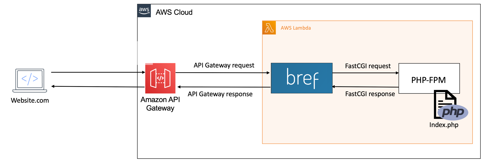

import { Callout } from 'nextra/components';
export const introduction = 'Learn how to run serverless HTTP applications with PHP on AWS Lambda using Bref.';

# PHP-FPM runtime for AWS Lambda

To run HTTP APIs and websites on AWS Lambda, Bref runs your code **using PHP-FPM**. That means PHP applications can run on Lambda just like on any other PHP hosting platform.

That's great: we can use our favorite framework as usual, like **Laravel or Symfony**.

<Callout>
    Every code we deploy on AWS Lambda is called a "Function". Do not let this name confuse you: we do deploy HTTP **applications** in a Lambda Function.

    In the Lambda world, an HTTP application is a *function* that is called by a request and returns a response. Good news: this is exactly what our PHP applications do.
</Callout>

## How it works

AWS Lambda can react to HTTP requests via [API Gateway](https://aws.amazon.com/api-gateway/). On Lambda, the Bref runtime starts PHP-FPM and forwards API Gateway requests to PHP-FPM via the FastCGI protocol.



Bref is basically doing the same thing as Apache or Nginx, and the PHP code runs in the same environment as on any server.

While this may sound like a lot to deploy an entire application inside Lambda, it works very well. Performance-wise, the overhead of the Bref runtime with PHP-FPM is less than a millisecond. Many users and companies have been running websites and HTTP APIs on Lambda at scale for years.

## Usage

To deploy an HTTP application on AWS Lambda, use the `php-xx-fpm` runtime and combine it with the `httpApi` event:

```yml filename="serverless.yml" {9-11}
service: app
provider:
    name: aws
plugins:
    - ./vendor/bref/bref
functions:
    app:
        handler: index.php
        runtime: php-81-fpm
        events:
            - httpApi: '*'
```

The `httpApi` event will deploy an API Gateway HTTP API and the `*` configuration will forward all requests to your PHP application.

### Handler

The *handler* is the file that is invoked when an HTTP request comes in.

It is the same file that is traditionally configured in Apache or Nginx. In Symfony and Laravel this is usually `public/index.php` but it can be anything.

```yml filename="serverless.yml"
functions:
    app:
        handler: public/index.php
```

## Context access

### Lambda context

Lambda provides information about the invocation, function, and execution environment via the *lambda context*.

Bref exposes the Lambda context in the `$_SERVER['LAMBDA_INVOCATION_CONTEXT']` variable as a JSON-encoded string.
Here is an example to retrieve it:

```php
$lambdaContext = json_decode($_SERVER['LAMBDA_INVOCATION_CONTEXT'], true);
```

### Request context

API Gateway integrations can add information to the HTTP request via the *request context*.
This is the case, for example, when using AWS Cognito authentication on API Gateway.

Bref exposes the request context in the `$_SERVER['LAMBDA_REQUEST_CONTEXT']` variable as a JSON-encoded string.
Here is an example to retrieve it:

```php
$requestContext = json_decode($_SERVER['LAMBDA_REQUEST_CONTEXT'], true);
```
