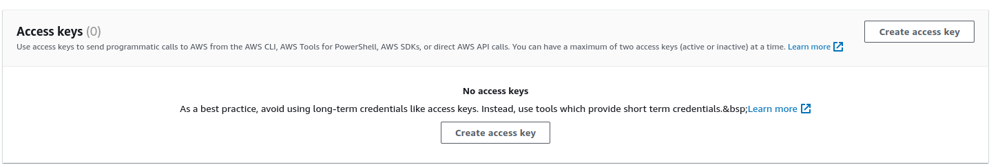

import { Callout } from 'nextra/components';
import { NextSeo } from 'next-seo';

<NextSeo description="How to create AWS access keys for Bref" />

# Creating AWS access keys

To create AWS access key for Bref and the `serverless` CLI tool follow these steps:

1. In the AWS dashboard, go into IAM and create a new user: [**click here** for a direct link](https://us-east-1.console.aws.amazon.com/iamv2/home#/users/create).

1. Set a user name (for example "bref-cli") and move to the next screen.

    

1. Click **Attach policies directly**, search for **AdministratorAccess** and select it.

    

    <Callout type="warning">
        The "AdministratorAccess" policy grants **full access** to your AWS account. This is simpler when starting with AWS and Bref. However, it is recommended to restrict permissions further eventually (especially if you create access to other members of your team). Here is an example of an [IAM policy with stricter permissions](./minimal-aws-policy.mdx), use it as a starting point.  
        Alternatively, you can check out [Bref Cloud](/cloud): it lets you deploy without creating AWS access keys, and lets you manage access to team members via simple permissions (read-only, write, admin).
    </Callout>

1. Finish creating the user.

1. Once your user is created, select it and go to **Security credentials**.

   

1. Scroll down to **Access Keys** and click on **Create access key**.

   

1. Then select **Command Line Interface**.

   

1. Add a description to your access keys and click on **Create access key**.

   

[< Back to the installation guide](../setup.mdx)
