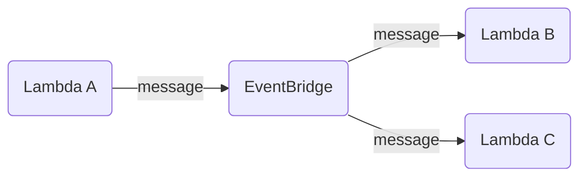
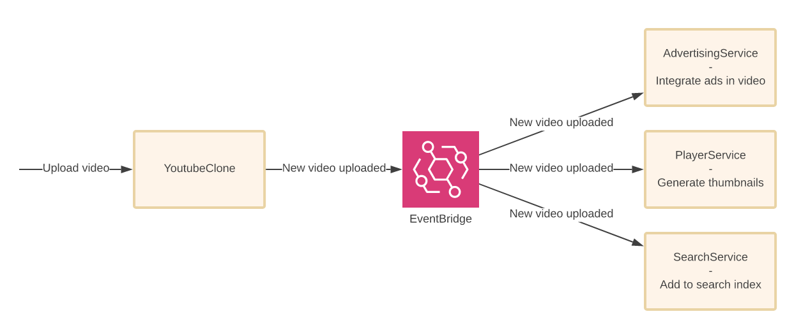

import { Tab, Tabs } from 'nextra/components';

# EventBridge event bus

[EventBridge](https://aws.amazon.com/eventbridge/) is a managed event bus that is perfect for exchanging asynchronous messages between applications and microservices.



To handle EventBridge events, extend the `EventBridgeHandler` class:

```php
use Bref\Context\Context;
use Bref\Event\EventBridge\EventBridgeEvent;
use Bref\Event\EventBridge\EventBridgeHandler;

class MyHandler extends EventBridgeHandler
{
    public function handleEventBridge(EventBridgeEvent $event, Context $context): void
    {
        // We can retrieve the message data via `$event->getDetail()`
        $message = $event->getDetail();

        // do something
    }
}
```

Then, create a Lambda function that listens to EventBridge events with the handler you created:

<Tabs items={['Laravel', 'Symfony', 'PHP']}>
    <Tab>
        ```yml filename="serverless.yml"
        functions:
            # ...
            resizeImage:
                handler: App\MyHandler
                runtime: php-83
                events:
                    - eventBridge:
                        pattern:
                            detail-type:
                                - 'MyCustomEvent'
        ```

        The `App\MyHandler` class will be instantiated by Laravel's service container.
    </Tab>
    <Tab>
        ```yml filename="serverless.yml"
        functions:
            # ...
            resizeImage:
                handler: App\MyHandler
                runtime: php-83
                events:
                    - eventBridge:
                        pattern:
                            detail-type:
                                - 'MyCustomEvent'
        ```

        The `App\MyHandler` class will be instantiated by Symfony's service container.
    </Tab>
    <Tab>
        ```yml filename="serverless.yml"
        functions:
            # ...
            resizeImage:
                handler: handler.php
                runtime: php-83
                events:
                    - eventBridge:
                        pattern:
                            detail-type:
                                - 'MyCustomEvent'
        ```

        The file `handler.php` should return the handler instance:

        ```php filename="handler.php"
        <?php

        require __DIR__ . '/vendor/autoload.php';

        return new MyHandler();
        ```
    </Tab>
</Tabs>

You can learn more about messaging with EventBridge in [Serverless Visually Explained](https://serverless-visually-explained.com/).

[](https://serverless-visually-explained.com/)

Learn more about all the options available for EventBridge in `serverless.yml` [in the Serverless Framework documentation](https://www.serverless.com/framework/docs/providers/aws/events/event-bridge/).
