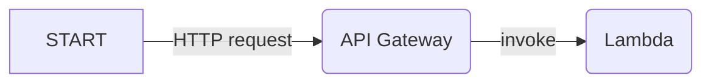

import { Card, Cards } from 'nextra/components';
// Path relative to the copy in the `website/` folder
import { LaravelIcon } from '../../../components/icons/LaravelIcon';
import { SymfonyIcon } from '../../../components/icons/SymfonyIcon';

# Serverless HTTP applications

Bref deploys HTTP applications to run on AWS Lambda with [API Gateway](https://aws.amazon.com/api-gateway/):



On AWS Lambda there is no Apache or Nginx, API Gateway acts as the webserver. Our code is invoked only when there is an HTTP request, and we pay only for the request and the execution time of our code.

Bref takes care of setting up everything so that your code runs the same way as on a traditional server with Apache or Nginx.

## Usage

HTTP applications is the default use case with Bref. That's why there is (almost) no documentation here.

Instead, head to the **Getting started** guide for your framework:

<Cards num={2}>
    <Card icon={<LaravelIcon />} title="Get started with Laravel" arrow="true" href="/docs/laravel/getting-started" />
    <Card icon={<SymfonyIcon />} title="Get started with Symfony" arrow="true" href="/docs/symfony/getting-started" />
    <Card title="Get started with any PHP framework" arrow="true" href="/docs/default/getting-started" />
</Cards>

## How it works

Bref sets up API Gateway with AWS Lambda and the [PHP-FPM runtime](../runtimes/fpm-runtime.mdx). This is done via the `php-xx-fpm` runtime and the `httpApi` event:

```yml filename="serverless.yml"
functions:
    web:
        handler: public/index.php
        runtime: php-81-fpm
        events:
            - httpApi: '*'
```

This configuration deploys an API Gateway that forwards all routes (`*` is a wildcard) to AWS Lambda.

On Lambda, the `php-81-fpm` runtime starts PHP-FPM and forwards all requests to it. PHP-FPM then runs the PHP code.

This is perfect for most use-cases: **PHP works like on any server** with PHP-FPM. HTTP routing based on the URL is done by the application/the framework.

The `handler` is the entrypoint of the application, usually `public/index.php` in most frameworks. That entrypoint kicks off the framework/your application, which does the routing and invokes the controllers, as usual. All the usual environment variables (like `$_GET`, `$_SERVER`, etc.) and functions (`header()`, etc.) work.

That works well with frameworks like Symfony or Laravel that have a single entrypoint (e.g. `public/index.php`).

Read the [PHP-FPM runtime documentation](../runtimes/fpm-runtime.mdx) to learn more.

### Differences with Apache and Nginx on a server

While Bref tries to make the experience as close as possible to running on a traditional server, there are some minor differences.

This section lists the differences between running on AWS Lambda and running on a traditional server with Apache or Nginx.

#### No `.htaccess` or `nginx.conf`

There is no `.htaccess` or `nginx.conf` on AWS Lambda. Instead, you can use `serverless.yml` to configure the routing.

#### No `fastcgi_finish_request()`

[`fastcgi_finish_request()`](https://www.php.net/manual/en/function.fastcgi-finish-request.php) is disabled by Bref, as it is not possible to run code after the response has been sent to the client. All frameworks are designed to work without it transparently, so you don't need to do anything.

#### Differences in URI query parameters

In a few edge cases, Bref parses some URI query parameters differently than PHP on a server with PHP-FPM. This is intentional, as this fixes very surprising behaviors from PHP. Here is an exhaustive list of differences:

- `?a.b=c` is parsed as:
    - `['a_b' => 'c']` on a server with PHP-FPM (yes, the dot is replaced by an underscore)
    - `['a.b' => 'c']` with Bref
- `?a=1&a=2&a=3` is parsed as:
    - `['a' => 3]` on a server with PHP-FPM
    - `['a' => [1, 2, 3]]` with Bref
- `?a=1&a=2&a[]=3&a[]=4` is parsed as:
    - `['a' => [3, 4]]` on a server with PHP-FPM
    - `['a' => [1, 2, 3, 4]` with Bref
