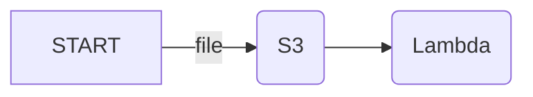

import { Callout, Tab, Tabs } from 'nextra/components';

# S3 file processing

[S3 can trigger Lambda functions](https://docs.aws.amazon.com/lambda/latest/dg/with-s3.html) whenever a file is added, modified, or deleted in an S3 bucket.



This can be used to process files, for example to resize images, generate thumbnails, convert videos, after they are uploaded to S3.

To handle S3 events, extend the `S3Handler` class:

```php
use Bref\Context\Context;
use Bref\Event\S3\S3Event;
use Bref\Event\S3\S3Handler;

class MyHandler extends S3Handler
{
    public function handleS3(S3Event $event, Context $context): void
    {
        $bucketName = $event->getRecords()[0]->getBucket()->getName();
        $fileName = $event->getRecords()[0]->getObject()->getKey();

        // do something with the file
    }
}
```

Then, create a Lambda function that listens to S3 events with the handler you created:

<Tabs items={['Laravel', 'Symfony', 'PHP']}>
    <Tab>
        ```yml filename="serverless.yml"
        functions:
            # ...
            resizeImage:
                handler: App\MyHandler
                runtime: php-82
                events:
                    - s3: photos
        ```

        The `App\MyHandler` class will be instantiated by Laravel's service container.
    </Tab>
    <Tab>
        ```yml filename="serverless.yml"
        functions:
            # ...
            resizeImage:
                handler: App\MyHandler
                runtime: php-82
                events:
                    - s3: photos
        ```

        The `App\MyHandler` class will be instantiated by Symfony's service container.
    </Tab>
    <Tab>
        ```yml filename="serverless.yml"
        functions:
            # ...
            resizeImage:
                handler: handler.php
                runtime: php-82
                events:
                    - s3: photos
        ```

        The file `handler.php` should return the handler instance:

        ```php filename="handler.php"
        <?php

        require __DIR__ . '/vendor/autoload.php';

        return new MyHandler();
        ```
    </Tab>
</Tabs>

The S3 bucket will automatically be created on deployment. You can listen to an existing S3 bucket via [the `existing: true` option](https://www.serverless.com/framework/docs/providers/aws/events/s3/#using-existing-buckets).
Or you can use the [`Storage` feature of the Lift plugin](https://github.com/getlift/lift/blob/master/docs/storage.md). For example:

```yml filename="serverless.yml"
constructs:
    reports-bucket:
        type: storage

functions:
    resizeImage:
        handler: handler.php
        runtime: php-82
        events:
            - s3:
                bucket: ${construct:reports-bucket.bucketName}
                existing: true
                event: s3:ObjectCreated:*
# ...


```

Learn more about all the options available for S3 in `serverless.yml` [in the Serverless Framework documentation](https://www.serverless.com/framework/docs/providers/aws/events/s3/).

<Callout type="warning">
    Watch out for recursive triggers: if your Lambda function writes files to the same S3 bucket, it will trigger itself again. You can avoid this by using a different bucket for the output files, or by using a prefix for the output files.
</Callout>
