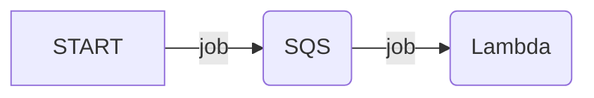

import { Callout, Tab, Tabs } from 'nextra/components';

# SQS asynchronous tasks

SQS is a service (like RabbitMQ) that allows you to queue messages (aka "jobs"). It is a good fit for asynchronous tasks because it integrates natively with AWS Lambda.



Whenever a new message (job) is sent to SQS, Lambda is invoked with the message data. That means that there is no need to poll SQS, or run daemon/long-running processes to wait for messages. Lambda is invoked only when there are messages to process.

<Callout>
    If you are using Laravel or Symfony, you should look at the Laravel Queues integration or Symfony Messenger integration instead of integrating with SQS events directly:

    - [Laravel Queues integration](/docs/laravel/queues)
    - [Symfony Messenger integration](/docs/symfony/messenger)
</Callout>

## Handling SQS events

To handle [SQS events](https://docs.aws.amazon.com/lambda/latest/dg/with-sqs.html), extend the `SqsHandler` class:

```php
use Bref\Context\Context;
use Bref\Event\Sqs\SqsEvent;
use Bref\Event\Sqs\SqsHandler;

class MyHandler extends SqsHandler
{
    public function handleSqs(SqsEvent $event, Context $context): void
    {
        foreach ($event->getRecords() as $record) {
            // We can retrieve the message body of each record via `->getBody()`
            $body = $record->getBody();

            // do something
        }
    }
}
```

Then, create a Lambda function that listens to SQS events with the handler you created:

<Tabs items={['Laravel', 'Symfony', 'PHP']}>
    <Tab>
        ```yml filename="serverless.yml"
        functions:
            # ...
            resizeImage:
                handler: App\MyHandler
                events:
                    - sqs:
                        arn: arn:aws:sqs:eu-west-1:111111111111:queue-name
                        # process one message at a time
                        batchSize: 1
        ```

        The `App\MyHandler` class will be instantiated by Laravel's service container.
    </Tab>
    <Tab>
        ```yml filename="serverless.yml"
        functions:
            # ...
            resizeImage:
                handler: App\MyHandler
                events:
                    - sqs:
                        arn: arn:aws:sqs:eu-west-1:111111111111:queue-name
                        # process one message at a time
                        batchSize: 1
        ```

        The `App\MyHandler` class will be instantiated by Symfony's service container.
    </Tab>
    <Tab>
        ```yml filename="serverless.yml"
        functions:
            # ...
            resizeImage:
                handler: handler.php
                events:
                    - sqs:
                        arn: arn:aws:sqs:eu-west-1:111111111111:queue-name
                        # process one message at a time
                        batchSize: 1
        ```

        The file `handler.php` should return the handler instance:

        ```php filename="handler.php"
        <?php

        require __DIR__ . '/vendor/autoload.php';

        return new MyHandler();
        ```
    </Tab>
</Tabs>

## Creating SQS queues

It is possible to deploy a preconfigured SQS queue in `serverless.yml` using the [`Queue` feature of the Lift plugin](https://github.com/getlift/lift/blob/master/docs/queue.md). For example:

```yml filename="serverless.yml"
constructs:
    my-queue:
        type: queue
        worker:
            handler: handler.php
```

## Partial Batch Response

While handling a batch of records, you can mark it as partially successful to reprocess only the failed records.

In your function declaration in `serverless.yml`, set `functionResponseType` to `ReportBatchItemFailures` to let your function return a partial success result if one or more messages in the batch have failed.

```yml filename="serverless.yml"
functions:
    worker:
        handler: handler.php
        events:
            - sqs:
                arn: arn:aws:sqs:eu-west-1:111111111111:queue-name
                batchSize: 10
                functionResponseType: ReportBatchItemFailures
```

In your PHP code, you can now use the `markAsFailed` method:

```php
    public function handleSqs(SqsEvent $event, Context $context): void
    {
        foreach ($event->getRecords() as $record) {
            // do something

            // if something went wrong, mark the record as failed
            $this->markAsFailed($record);
        }
    }
```

## Learn more

Learn more about all the options available for SQS events in `serverless.yml` [in the Serverless Framework documentation](https://www.serverless.com/framework/docs/providers/aws/events/sqs/).

You can also learn more about SQS, workers, scaling queues, and dealing with errors in [Serverless Visually Explained](https://serverless-visually-explained.com/).
