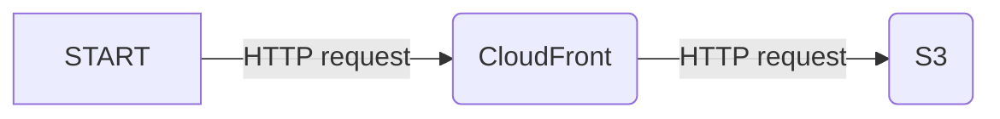

# Static websites

To serve a static website, we do not need PHP nor AWS Lambda. We can host the website on any static hosting service (like Netlify, Vercel, etc.) or on AWS with CloudFront and S3:

To deploy such a website with Bref and `serverless.yml`, we can use [Lift](https://github.com/getlift/lift):

- The [`static-website` construct](https://github.com/getlift/lift/blob/master/docs/static-website.md) for plain static HTML websites
- The [`single-page-app` construct](https://github.com/getlift/lift/blob/master/docs/single-page-app.md) for Single-Page Applications like React or VueJS

Lift allows configuring custom domains, root domain to www redirects, and more. Check out the documentation linked above for more details.
