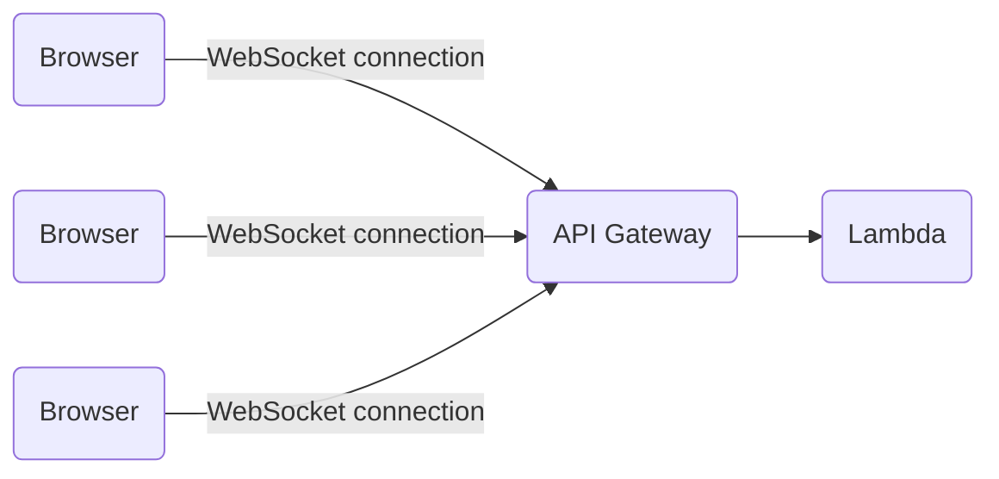

import { Callout, Tab, Tabs } from 'nextra/components';

# WebSockets

WebSockets are great for bringing real-time updates to a web application. They allow sending events from the backend application to the frontend (JavaScript) application.

Implementing WebSockets implies maintaining a long-lived connection between the JavaScript client and the backend. As you can imagine, that is not possible with AWS Lambda. Indeed, Lambda only runs code on events: it is impossible to run code continuously.

API Gateway [can solve that problem](https://docs.aws.amazon.com/apigateway/latest/developerguide/websocket-api-develop.html): API Gateway maintains the long-lived WebSocket connections and invokes Lambda when an event happens (connection, disconnection, message).



To handle WebSocket events, extend the `WebsocketHandler` class:

```php
use Bref\Context\Context;
use Bref\Event\ApiGateway\WebsocketEvent;
use Bref\Event\ApiGateway\WebsocketHandler;
use Bref\Event\Http\HttpResponse;

class MyHandler extends WebsocketHandler
{
    public function handleWebsocket(WebsocketEvent $event, Context $context): HttpResponse
    {
        $route = $event->getRouteKey();
        $eventType = $event->getEventType();
        $body = $event->getBody();

        return new HttpResponse('ok');
    }
}
```

To send a message to a client connected you can use [bref/api-gateway-websocket-client library](https://github.com/brefphp/api-gateway-websocket-client) to make an http request to the endpoint provided by AWS.

Learn more about using WebSockets in `serverless.yml` [in the Serverless Framework documentation](https://www.serverless.com/framework/docs/providers/aws/events/websocket/).

<Callout>
    A complete WebSocket example is available in [Serverless Visually Explained](https://serverless-visually-explained.com/).
</Callout>
