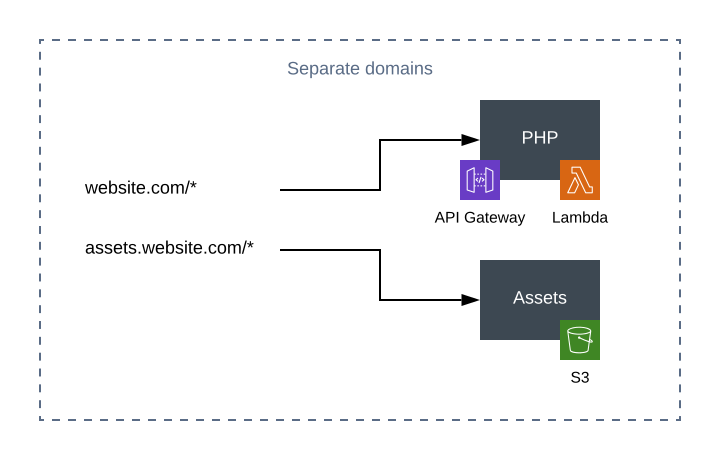
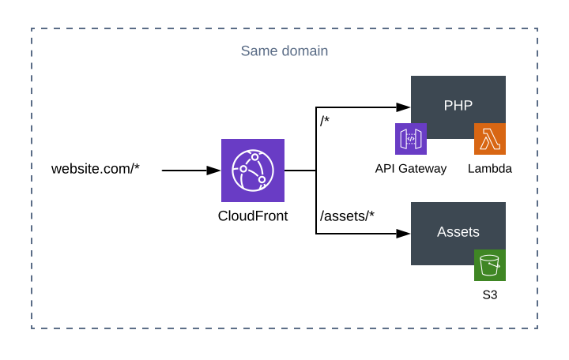
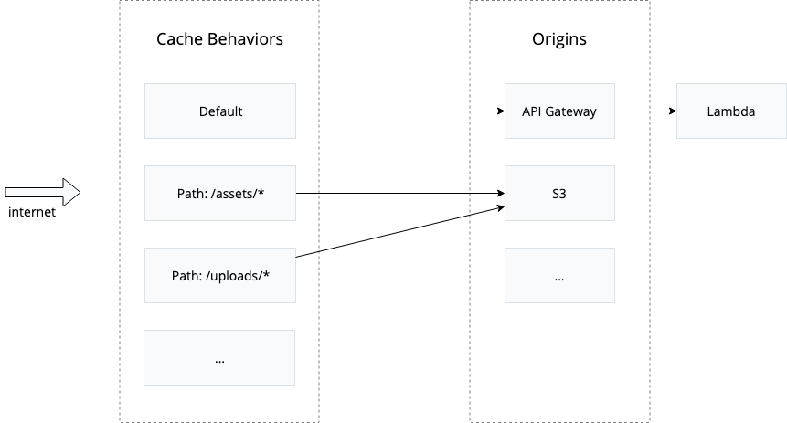

> Before reading this article we assume that you have read [Bref's introduction](/docs/first-steps.md) and that you are familiar with [Bref's HTTP runtime](/docs/runtimes/http.md).

## Architectures

Websites usually contain 2 parts:

- PHP code, running on [AWS Lambda + API Gateway with the HTTP runtime](/docs/runtimes/http.md)
- static assets (CSS, JS…), [hosted on AWS S3](https://docs.aws.amazon.com/AmazonS3/latest/dev/WebsiteHosting.html)

You will find below different architectures for creating websites.

### Separate domains



This architecture is the simplest. Assets are hosted on a separate domain than the PHP code.

The main downside is that **API Gateway only supports HTTPS**. Hosting websites on HTTPS is a good thing, however that means that there is no redirection from HTTP to HTTPS. In short, `https://website.com` will work but not `http://website.com`. It is up to you to decide if this limitation is acceptable for your use case.

### Same domain



This architecture is more complex, as [CloudFront](https://aws.amazon.com/cloudfront/) (the AWS CDN) serves as a HTTP/HTTPS proxy.

This lets us host everything under the same domain and support both HTTP and HTTPS.

On top of that, CloudFront can act as a CDN and cache assets and web pages all over the world. This is however not documented in this page.

## Hosting static files with S3

This section explains how to host assets on S3.

### Creating a S3 bucket

S3 stores files in "buckets". You will need to create one for your website.

If you plan on using a custom domain for S3 URLs, the bucket must be named after the domain. For example `assets.website.com`. Learn more about this [in the official AWS documentation](https://docs.aws.amazon.com/AmazonS3/latest/dev/website-hosting-custom-domain-walkthrough.html).

If you plan to use CloudFront, you can use any name for the bucket.

In order to automate everything let's create and configure the bucket using `serverless.yml`:

```yaml
...

resources:
    Resources:
        # The S3 bucket that stores the assets
        Assets:
            Type: AWS::S3::Bucket
            Properties:
                BucketName: <bucket-name>
        # The policy that makes the bucket publicly readable
        AssetsBucketPolicy:
            Type: AWS::S3::BucketPolicy
            Properties:
                Bucket: !Ref Assets # References the bucket we defined above
                PolicyDocument:
                    Statement:
                        -   Effect: Allow
                            Principal: '*' # everyone
                            Action: 's3:GetObject' # to read
                            Resource: 'arn:aws:s3:::<bucket-name>/*' # things in the bucket
```

Don't forget to replace `<bucket-name>` with the bucket name of your choice.

After [deploying with `serverless deploy`](/docs/deploy.md), the static files will be served from `https://<bucket>.s3.amazonaws.com/`. Read the next section to upload your files.

You can either [setup a custom domain to point to this URL](environment/custom-domains.md#custom-domains-for-static-files-on-s3) or setup CloudFront as explained below.

> In this section we explained how to host assets on S3. It is also possible to host static websites on S3 (i.e. HTML files). In that cas you will need to enable this feature and use different S3 URLs. See [the AWS documentation](https://docs.aws.amazon.com/AmazonS3/latest/dev/WebsiteHosting.html) to learn more.

If you need to enable CORS, for example if a CSS or JavaScript file needs to load additional resources like fonts from S3:

```yaml
resources:
    Resources:
        Assets:
            Type: AWS::S3::Bucket
            Properties:
                BucketName: <bucket-name>
                CorsConfiguration:
                    CorsRules:
                        -   AllowedHeaders: ["*"]
                            AllowedMethods: [GET]
                            AllowedOrigins: ["*"]
```

More options can be set on the bucket, [read more here](https://docs.aws.amazon.com/AWSCloudFormation/latest/UserGuide/aws-properties-s3-bucket.html).

### Uploading files to S3

It is not possible to use `serverless deploy` to upload files to S3, you need to upload them separately. To do this, you can use the [`aws s3 sync` command](https://docs.aws.amazon.com/cli/latest/reference/s3/sync.html):

```bash
aws s3 sync <directory> s3://<bucket-name> --delete
```

Be aware that the content of the bucket is public!

## Serving PHP and static files via CloudFront

This section assumes you have already deployed your static files on S3 as shown above.

As explained at the beginning of this page, CloudFront will let us:

- serve the PHP application and static files under the same domain
- support both HTTP and HTTPS

This diagram helps understand how CloudFront works:



CloudFront forwards HTTP requests to "Origins" (API Gateway/Lambda, S3, etc.) based on "Cache Behaviors".

A cache behavior can match a specific URL pattern, and can have a specific caching configuration (e.g. cache the responses for 10 days).

The `serverless.yml` example below:

- forwards URLs that start with `/assets/` to S3 (static files)
- forwards all the other requests to Lambda

CloudFront is configured via CloudFormation template, which explains why a lot of YAML is involved. To keep it simpler and to circumvent a `serverless.yml` limitation, we will use the [serverless-pseudo-parameters](https://github.com/svdgraaf/serverless-pseudo-parameters) plugin. To install it, run:

```bash
npm install serverless-pseudo-parameters
```

That will let us for example replace `!Sub '${Assets.Arn}/*'` (not supported in `serverless.yml`) with `'#{Assets.Arn}/*'`.

```yaml
service: app
provider:
    name: aws
    runtime: provided

functions:
    website:
        handler: public/index.php
        layers:
            - ${bref:layer.php-73-fpm}
        events:
            -   http: 'ANY /'
            -   http: 'ANY {proxy+}'

plugins:
    - ./vendor/bref/bref
    # This lets us use `#{Assets.Arn}` variables
    - serverless-pseudo-parameters

resources:
    Resources:
        # The S3 bucket that stores the assets
        Assets:
            # [...] see the previous section for details 
        AssetsBucketPolicy:
            # [...] see the previous section for details 
    
        WebsiteCDN:
            Type: AWS::CloudFront::Distribution
            Properties:
                DistributionConfig:
                    Enabled: true
                    # Cheapest option by default (https://docs.aws.amazon.com/cloudfront/latest/APIReference/API_DistributionConfig.html)
                    PriceClass: PriceClass_100
                    # Enable http2 transfer for better performances
                    HttpVersion: http2
                    # Origins are where CloudFront fetches content
                    Origins:
                        # The website (AWS Lambda)
                        -   Id: Website
                            DomainName: '#{ApiGatewayRestApi}.execute-api.#{AWS::Region}.amazonaws.com'
                            OriginPath: '/dev'
                            CustomOriginConfig:
                                OriginProtocolPolicy: 'https-only' # API Gateway only supports HTTPS
                        # The assets (S3)
                        -   Id: Assets
                            # Use s3-website URLs instead if you host a static website (https://stackoverflow.com/questions/15309113/amazon-cloudfront-doesnt-respect-my-s3-website-buckets-index-html-rules#15528757)
                            DomainName: '#{Assets}.s3.amazonaws.com'
                            CustomOriginConfig:
                                OriginProtocolPolicy: 'http-only' # S3 websites only support HTTP
                    # The default behavior is to send everything to AWS Lambda
                    DefaultCacheBehavior:
                        AllowedMethods: [GET, HEAD, OPTIONS, PUT, POST, PATCH, DELETE]
                        TargetOriginId: Website # the PHP application
                        # Disable caching for the PHP application https://aws.amazon.com/premiumsupport/knowledge-center/prevent-cloudfront-from-caching-files/
                        DefaultTTL: 0
                        MinTTL: 0
                        MaxTTL: 0
                        # https://docs.aws.amazon.com/AWSCloudFormation/latest/UserGuide/aws-properties-cloudfront-distribution-forwardedvalues.html
                        ForwardedValues:
                            QueryString: true
                            Cookies:
                                Forward: all # Forward cookies to use them in PHP
                            # We must *not* forward the `Host` header else it messes up API Gateway
                            Headers:
                                - 'Accept'
                                - 'Accept-Language'
                                - 'Origin'
                                - 'Referer'
                        ViewerProtocolPolicy: redirect-to-https
                    CacheBehaviors:
                        # Assets will be served under the `/assets/` prefix
                        -   PathPattern: 'assets/*'
                            TargetOriginId: Assets # the static files on S3
                            AllowedMethods: [GET, HEAD]
                            ForwardedValues:
                                # No need for all that with assets
                                QueryString: 'false'
                                Cookies:
                                    Forward: none
                            ViewerProtocolPolicy: redirect-to-https
                            Compress: true # Serve files with gzip for browsers that support it (https://docs.aws.amazon.com/AmazonCloudFront/latest/DeveloperGuide/ServingCompressedFiles.html)
                    CustomErrorResponses:
                        # Do not cache HTTP errors
                        -   ErrorCode: 500
                            ErrorCachingMinTTL: 0
                        -   ErrorCode: 504
                            ErrorCachingMinTTL: 0
```

Feel free to customize the `/asset/` path. If your application is a JS application backed by a PHP API, you will want to invert API Gateway and S3 (set S3 as the `DefaultCacheBehavior` and serve API Gateway under a `/api/` path).

> The first deployment takes a lot of time (20 minutes) because CloudFront is a distributed service. The next deployments that do not modify CloudFront's configuration will not suffer from this delay.

The URL of the deployed CloudFront distribution can be found in [the CloudFront dashboard](https://console.aws.amazon.com/cloudfront/home?region=eu-west-1#) under `Domain Name`.

### Setting up a domain name

Just like in the "[Custom domains](/docs/environment/custom-domains.md)" guide, you need to register your domain in **ACM** (AWS Certificate Manager) to get a HTTPS certificate.

- open [this link](https://console.aws.amazon.com/acm/home?region=us-east-1#/wizard/) or manually go in the ACM Console and click "Request a new certificate" **in the `us-east-1` region** (CloudFront requires certificates from `us-east-1`)
- add your domain name and click "Next"
- choose the domain validation of your choice
    - domain validation will require you to add entries to your DNS configuration
    - email validation will require you to click a link you will receive in an email sent to `admin@your-domain.com`

After validating the domain and the certificate we can now configure it in `template.yaml`.

Copy the ARN of the ACM certificate. It should look like this:

```
arn:aws:acm:us-east-1:216536346254:certificate/322f12ee-1165-4bfa-a41f-08c932a2935d
```

Add your domain name under `Aliases` and configure `ViewerCertificate` to use your custom HTTPS certificate:

```yaml
...
resources:
    Resources:
        WebsiteCDN:
            Type: AWS::CloudFront::Distribution
            Properties:
                DistributionConfig:
                    ...
                    # Custom domain name
                    Aliases:
                        - <custom-domain> # e.g. example.com
                    ViewerCertificate:
                        # ARN of the certificate created in ACM
                        AcmCertificateArn: <certificate-arn>
                        # See https://docs.aws.amazon.com/fr_fr/cloudfront/latest/APIReference/API_ViewerCertificate.html
                        SslSupportMethod: 'sni-only'
                        MinimumProtocolVersion: TLSv1.1_2016
```

The last step will be to point your domain name to the CloudFront URL:

- open [the CloudFront dashboard](https://console.aws.amazon.com/cloudfront/home?region=eu-west-1#) and look for the URL under `Domain Name`
- create a CNAME to point your domain name to this URL
    - if you use Route53 you can read [the official guide](https://docs.aws.amazon.com/Route53/latest/DeveloperGuide/routing-to-cloudfront-distribution.html)
    - if you use another registrar and you want to point your root domain (without `www.`) to CloudFront, you will need to use a registrar that supports this (for example [CloudFlare allows this with a technique called CNAME flattening](https://support.cloudflare.com/hc/en-us/articles/200169056-Understand-and-configure-CNAME-Flattening))
