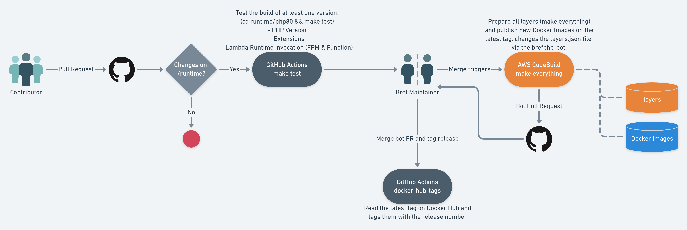

## Bref Runtime

Welcome to the internals of Bref! Here are some quick tips:

- To make a new PHP Version, copy `php81` into `php82`, search/replace `php81` with `php82` and change PHP_VERSION on `Makefile`.
- Check out `runtime/common/publish/generate-docker-compose.php` to add more regions.
- `runtime/common/utils/lib-check` is a small utility-tool to check whether we're copying unnecessary `.so` files into the Layer.
- `ldd` is a linux utility that will show libraries used by a binary e.g. `ldd /opt/bin/php` or `ldd /opt/php-modules/curl.so`

### How Lambda Layers work?

In a nutshell, a Lambda Layer is a `zip` file containing files that are extracted into `/opt` when a Lambda
is invoked. Anything we want to make available inside AWS Lambda is possible by preparing the right files
and packing them into a layer. For these files to work properly, they need to be compatible with the
environment which they'll be executed. AWS provides Docker images (e.g. `public.ecr.aws/lambda/provided:al2-x86_64`)
with an exact replica of how the environment will look like.

### Bref Runtime Structure

This project is designed for easily discarding old PHP versions and easily creating new ones. Almost everything
for a specific PHP Version stays inside `phpxx` folder. They are also optimized for packing single layers
for testing. Any contributor that wants to make changes to the layers will feel more confident about their
contribution if they can test them. A layer can be placed onto your own AWS Account by executing the following
steps:

- Edit `phpxx/Makefile` and add your own `AWS_PROFILE` at the top of the file.
- Run `make test` if you want to make sure the layers check are up-to-date.
- Run `make function` to deploy a Layer on your own account.
- You may choose which region layers get published at the top of `phpxx/Makefile`
- Run `make fpm` if you want to deploy an FPM Layer on your own account
- TODO: Console Layer.

### runtime/common/function & runtime/common/fpm

In order to make the Runtime self-sufficient, we need to include some basic functionality from Bref inside
the layer itself. We do this by packaging the `src` folder as a composer installation inside the `runtime/common`
folders. Two Docker Images are generated with Bref and it's minimal dependencies. This is what allows users
to create Lambda Functions using the AWS Console and run their function on-the-fly (no composer or serverless deploy necessary).

### runtime/common/publish

In order to publish layers in parallel, we use a `docker-compose` file with one container per region. That means
we can upload 21 layers in bulk. The containers expect a `TYPE` environment variable to locate and upload the zip
file. The zip files are generated and stored in `/tmp/bref-zip/` folder on the root machine.

### The php{xx} folder

This is the heart of Bref Runtime Layers. We configure php using the `config` folder to store `php.ini` files that
will be copied into `/opt/php-ini`. Note that we configure `/opt/bootstrap` to execute PHP with `PHP_INI_SCAN_DIR=/opt/php-ini:/var/task/php/conf.d/`.
We also have a `Makefile` to facilitate the development, testing and building of layers. The command `make test`
will build Docker Images with everything necessary for Bref Runtime and then run containers with `runtime/tests` files
that will validate:

1- The PHP Binary and it's version
2- The Core Extensions installed by default
3- The Additional Extensions Bref provide by default
4- The Disabled Extensions Bref provide by default
5- Function Invocation using AWS Runtime Interface Emulator
6- FPM Invocation using AWS Runtime Interface Emulator

The Dockerfile attempts at a best-effort to follow a top-down execution process for easier reading. It starts from
an AWS-provided Docker Image and installs PHP. Some standard files (such as the php binary) can already be
isolated into the `/bref` folder. The use of multiple Docker Layers helps with automation tests and investigations
because the developer can have a faster feedback loop by checking each step of the process incrementally instead
of trying to figure out why an entire build is failing.

The 2nd layer is the `extensions` where all extensions are installed and isolated into the `/bref` folder.
Reminder that `ldd` is a linux utility that helps discover which files need isolating.

The 3rd layer is the `isolation` layer where we'll start from the standard AWS-provided image all over again
(getting rid of any residual unnecessary file) and then copying `/bref` into `/opt`. PHP Configurations are
copied here as well.

The 4th layer is the `function` layer where everything is packet together and the `bootstrap` file is loaded.
The `bref-internal-src` images (see runtime/common/function & runtime/common/fpm) are used to load Bref
classes into the layer.

The 5th layer is `zip-function`, where we get a small and fast Linux (Alpine) just to install and zip the entire
`/opt` content. We use docker-compose volumes to map `/tmp/bref-zip` from host to the container so that we can
zip everything and get the zipped file out of the container.

The 6th layer goes back to `extensions` and start `fpm-extension`. Here we're back at step 2 so that we can install
`fpm`.

The 7th layer goes back to `isolation` and start `fpm`. It mimics steps 3th and 4th but for the FPM Layer.

Lastly, layer 8th zips FPM and pack everything ready for AWS Lambda.

### The Root Directory

The Root Directory was designed for Bref use only. Anybody is welcome to use it, but the intention is to prepare
every PHP version (in parallel) and then upload to every AWS Region at once. Contributors trying to test things
out will usually not want to "pollute" their AWS account by publishing the same layer on EVERY region. Hence,
the `Makefile` on each PHP Version folder being more useful for contributors since it allows to publish
a single layer on a single AWS Region.

### Runtime Changes Workflow

### Decision log

##### Installing PHP from a distribution

Compiling PHP is a complex process for the average PHP Developer. It takes a fair amount of time
and can be cumbersome. Using remi-collet as a PHP distributor greatly simplifies and help the
installation process. The code is more readable and approachable. Remi also distribute releases
even before they are announced on the PHP Internal Mailing List by the Release Manager.

The biggest downside is that we're no longer in control of compiling new releases whenever we want.
But for x86 architecture, we see that using remi-collet will not be a problem for this.
We can see the impact of this on arm64 (Graviton2 Support). Since remi-collet doesn't distribute arm64,
we may have to rely on amazon-linux-extras, which is 5 months behind (as of this writing) with PHP 8.0.8.

##### Bundling extensions

While developing a new Runtime, the first attempt was to provide an "alpine-like" Bref Layer: only the PHP
binary and no extension (or minimal extensions) installed. This turned out to slow down the process
by a big factor because every layer needs to be compiled for multiple PHP versions and deployed
across 21 AWS Region (at this time). Except for php-intl, most extensions are extremely small and lightweight.
The benefits of maintaining a lightweight layer long-term didn't outweight the costs at this time.

##### Variables vs Repetitive Code

Before landing on the current architecture, there was several attempts (7 to be exact) on a back-and-forth
between more environment variables vs more repetitive code. Environment variables grows complexity because
they require contributors to understand how they intertwine with each other. We have layers, php version and
CPU architecture. A more "reusable" Dockerfile or docker-compose requires a more complex Makefile. In contrast,
a simpler and straight-forward Makefile requires more code duplication for Docker and Docker Compose.
The current format makes it so that old PHP layers can easily be removed by dropping an entire folder
and a new PHP Version can be added by copying an existing folder and doing search/replace on the
PHP version. It's a hard balance between a process that allows parallelization, code reusability and
readability.

##### Layer Publishing

It would have been ideal to be able to upload the layers to a single S3 folder and then "publish" a new
layer by pointing it to the existing S3Bucket/S3Key. However, AWS Lambda does not allow publishing layers
from a bucket in another region. Layers must be published on each region individually.

Parallelization of all regions at once often leads to network crashing. The strategy applied divides AWS
regions in chunks (7 to be precise) and tries to publish 7 layers at a time. AWS CodeBuild LARGE instance
has 8 vCPU, so publishing 7 layers at a time should go smooth.

##### AWS CodeBuild vs GitHub Actions

AWS CodeBuild is preferred for publishing the layers because the account that holds the layers has no external
access. It is dedicated exclusively for having the layers only and only Matthiew Napoli has access to it.
GitHub Actions require exposing access to an external party. Using AWS CodeBuild allows us to use IAM Assume
Role so that one "Builder Account" can build the layers and then cross-publish them onto the "Layer Account".
The assume role limitations can be seen on runtime/aws/access.yml

##### Automation tests

the runtime/tests folder contains multiple PHP scripts that are executed inside a docker container that Bref builds.
These scripts are suppose to ensure that the PHP version is expected, PHP extensions are correctly installed and
available and PHP is correctly configured. Some acceptance tests uses AWS Runtime Interface Emulator (RIE) to
test whether a Lambda invocation is expected to work.

##### bootstrap.sh file

The bootstrap.sh file that exists on all layers is the entrypoint that AWS Lambda will execute to start
Bref's layer. We strive to keep it to a minimum and leave it to mostly execute `src/Toolbox/bootstrap.php`
so that every layer has the same starting process. We do differentiate them through an argument 
(function, fpm, console) in order to instruct Bref on how to properly boot up the process.
One other use of bootstrap.sh is to define `PHP_INI_SCAN_DIR` before any PHP script has started
so that we have a chance to configure which folders we want to look for PHP configuration files.
