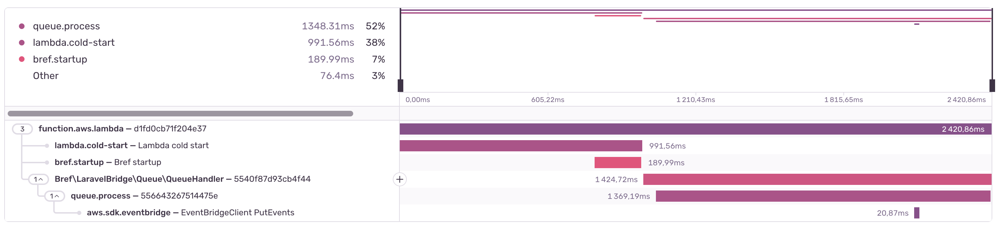

import Breadcrumbs from '../../components/Breadcrumbs';
import { Callout } from 'nextra/components';

<Breadcrumbs pages={[
    { name: 'Sentry', href: '/sentry' },
    { name: 'Documentation', href: '/sentry/docs' },
]} />

# Sentry integration - Documentation

This package provides an advanced integration between Bref applications and [Sentry monitoring](https://sentry.io/):

- Trace cold starts in performance tracing
- Capture exceptions and trace event handlers using the [function runtime](/docs/runtimes/function) (like EventBridge, SQS, S3…)
- Trace AWS SDK calls in performance tracing

Check out the documentation below for screenshots and more details.

## Installation

Before getting started, make sure you have set up Sentry in your application ([documentation for PHP](https://docs.sentry.io/platforms/php/), [for Laravel](https://docs.sentry.io/platforms/php/guides/laravel/) or [for Symfony](https://docs.sentry.io/platforms/php/symfony/)).

When configuring Sentry, you can set the Sentry "DSN" in a `.env` file (if you framework supports it) or in an environment variable in `serverless.yml`.

### 1. Enable Packagist.com

The `bref/sentry-integration` package is distributed via [Packagist.com](https://packagist.com), the alternative to [Packagist.org](https://packagist.org) for private packages (provided by the Composer team). To install the package, you will need:

- a Packagist.com **token**
- a Packagist.com sub-repository **URL**

You will receive both after purchasing a license on [the Bref website](/sentry).

Once you have your license, enable Packagist.com in your `composer.json` by adding the sub-repository **URL**:

```json
{
    "repositories": [
        {"type": "composer", "url": "https://bref.repo.packagist.com/<your-org-name>/"}
    ]
}
```

<Callout>
    Make sure to replace the URL with the one provided with the license you purchased.
</Callout>

Next, configure the Packagist.com **token** (provided with the license you purchased).

- On developer machines, you can run the following command:

  ```bash
  composer config --global --auth http-basic.bref.repo.packagist.com token <your-token>
  ```
- In CI/CD environments, you can set the `COMPOSER_AUTH` environment variable:

  ```bash
  COMPOSER_AUTH='{"http-basic": {"bref.repo.packagist.com": {"username": "token", "password": "<token-here>"}}}'
  ```

<Callout>
    The token is for your whole organization, you can share it with your team.
</Callout>

### 2. Install the package

You can now install the package via Composer:

```bash
composer require bref/sentry-integration
```

If you use Laravel, the Laravel integration will be automatically set up via a service provider.

### Troubleshooting

Send me a Slack message or an email (matthieu@bref.sh) if you have any trouble, I can help you set it up!

## Usage

### Event-driven PHP runtime

When using the [event-driven function runtime](/docs/runtimes/function), event handlers will be automatically traced in Sentry:

- Exceptions will be captured and reported to Sentry
- Event handlers will be traced in performance tracing

This is done automatically and will work for all event handlers, for example EventBridge, SQS, S3, SNS, etc.

Here is an example of an EventBridge invocation captured in performance tracing:


Advanced metadata and tags will also be captured on each transaction, allowing to better debug any issue. For example:


### Cold starts tracing

Cold starts are automatically traced when using Laravel, there is nothing additional to set up.

Cold starts will appear in transactions in Sentry performance tracing (named `lambda.cold-start`), along with a sub-span for the Bref initialization (`bref.startup`). For example:


<Callout type="info">
    Note: because of technical limitation, the cold start span doesn't include the exact total time it takes for the AWS Lambda instance to boot (a few hundred milliseconds are missing).
</Callout>

#### Bref startup tracing

When using the [event-driven PHP runtime](/docs/runtimes/function), Bref might restart the PHP process between invocations (when not using [`BREF_LOOP_MAX`](/docs/environment/performances#bref-for-event-driven-functions)). This is not a full Lambda cold start, but a Bref process restart. This is traced in Sentry (`bref.startup`), however it is not part of the main transaction. Indeed, the restart happens after the Lambda invocation has completed, so it is not part of the HTTP response time.

This is why it is tracked as a separate "sub-transaction" in Sentry, named `bref.startup`:


Since it is a child of the main transaction, they are part of the same distributed trace and can be viewed together:


### Tracing AWS SDK calls

You can trace AWS SDK calls in Sentry performance tracing. This is useful to see which calls are slow and might be the cause of performance issues.

Trace AWS SDK calls by calling `AwsSdkTracer::trace($client)` after creating an AWS SDK client. For example:

```php
use Aws\EventBridge\EventBridgeClient;
use Bref\Sentry\AwsSdk\AwsSdkTracer;

$client = new EventBridgeClient([
    // ...
]);
AwsSdkTracer::trace($client);
```

This will add a span to the current transaction for each AWS SDK call. Here is an example where a SQS job handler sends a message to EventBridge:


