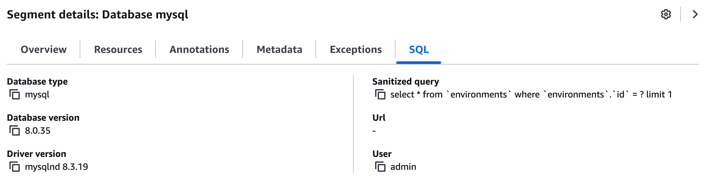
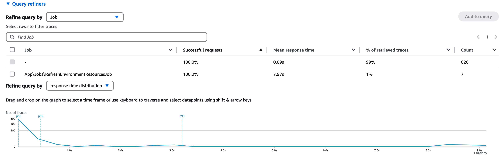
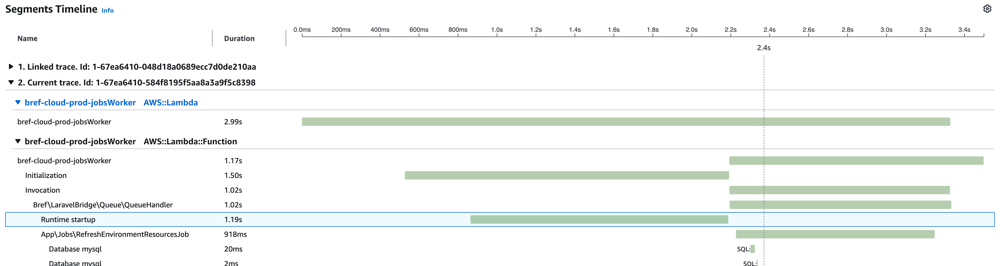
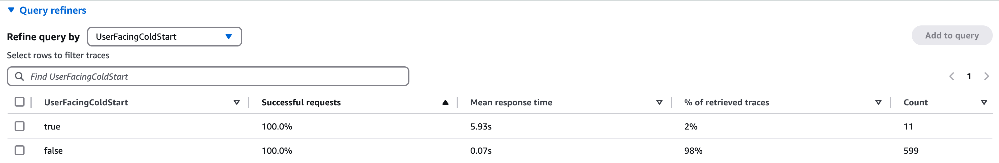
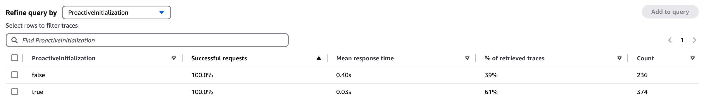
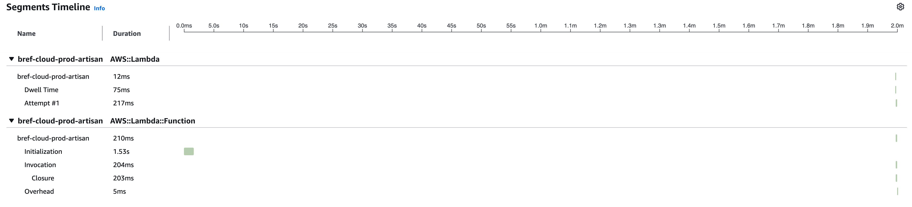
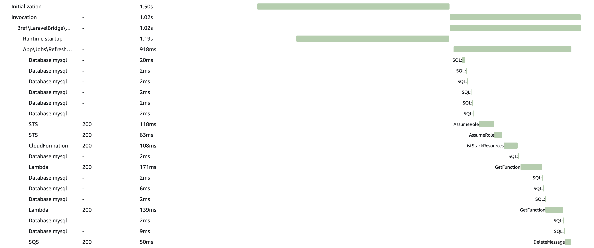

import Breadcrumbs from '../../components/Breadcrumbs';
import { Callout } from 'nextra/components';

<Breadcrumbs pages={[
    { name: 'X-Ray', href: '/xray' },
    { name: 'Documentation', href: '/xray/docs' },
]} />

# X-Ray integration - Documentation

This package provides an advanced integration between Bref applications and [AWS X-Ray monitoring](https://aws.amazon.com/xray/).

Check out the documentation below for screenshots and more details.

## Installation

### 1. Enable Packagist.com

The `bref/xray-integration` package is distributed via [Packagist.com](https://packagist.com), the alternative to [Packagist.org](https://packagist.org) for private packages (provided by the Composer team). To install the package, you will need:

- a Packagist.com **token**
- a Packagist.com sub-repository **URL**

You will receive both after purchasing a license on [the Bref website](/xray).

Once you have your license, enable Packagist.com in your `composer.json` by adding the sub-repository **URL**:

```json
{
    "repositories": [
        {"type": "composer", "url": "https://bref.repo.packagist.com/<your-org-name>/"}
    ]
}
```

<Callout>
    Make sure to replace the URL with the one provided with the license you purchased.
</Callout>

Next, configure the Packagist.com **token** (provided with the license you purchased).

- On developer machines, you can run the following command:

  ```bash
  composer config --global --auth http-basic.bref.repo.packagist.com token <your-token>
  ```
- In CI/CD environments, you can set the `COMPOSER_AUTH` environment variable:

  ```bash
  COMPOSER_AUTH='{"http-basic": {"bref.repo.packagist.com": {"username": "token", "password": "<token-here>"}}}'
  ```

<Callout>
    The token is for your whole organization, you can share it with your team.
</Callout>

### 2. Install the package

You can now install the package via Composer:

```bash
composer require bref/xray-integration -W
```

Enable X-Ray tracing in your `serverless.yml` file:

```yaml
provider:
    # ...
    tracing:
        lambda: true
        apiGateway: true # enable if you are using API Gateway
    iam:
        role:
            managedPolicies:
                - arn:aws:iam::aws:policy/AWSXRayDaemonWriteAccess
```

If you use Laravel, the Laravel integration will be automatically set up via a service provider.

If you use Symfony, you will need to manually register the bundle in `config/bundles.php`:

```php
return [
    // ...
    Bref\Apm\XRay\Symfony\BrefXrayBundle::class => ['all' => true],
];
```

### Troubleshooting

Send me a Slack message or an email (matthieu@bref.sh) if you have any trouble, I can help you set it up!

## Costs

AWS X-Ray is a paid service. You can find the pricing details on the [AWS X-Ray pricing page](https://aws.amazon.com/xray/pricing/). The free tier includes 100k traces per month. Beyond that, it is $5 per million traces.

One trace is one AWS Lambda invocation, i.e. one request or one job. X-Ray applies a sampling rate out of the box for AWS Lambda traces, so you will not be charged for all traces:

> The sampling rate is 1 request per second and 5 percent of additional requests.

This is quite useful: when an application has low traffic, most requests/invocations will be traced. However when traffic ramps up, X-Ray costs don't scale linearly with traffic because only a percentage of requests will be traced.

For applications with a lot of traffic in production, enabling X-Ray in development and staging environments can be a great way to help debug and troubleshoot issues without incurring high costs.

## Usage

### Laravel

If you are using Laravel, the package automatically integrates with the Laravel service provider. You can see the traces in the AWS X-Ray console.

#### Request tracing

The package automatically traces all requests to your application. You can see the traces in the AWS X-Ray console.

#### Database queries

Eloquent queries are automatically traced and the SQL queries are added to metadata.



#### Jobs

The package automatically traces all jobs dispatched via the Laravel queue. You can see the traces in the AWS X-Ray console, and filter them by job name.



The integration will also forward X-Ray trace IDs correctly so that distributed tracing works correctly. For example, if a job is dispatched from a Lambda function that is already traced, the job will be traced as well.


### Symfony

If you are using Symfony, the package automatically integrates with the Symfony service provider. You can see the traces in the AWS X-Ray console.

#### Symfony Messenger

To trace Symfony Messenger jobs across multiple services, you need to trace the AWS SDK client used by Symfony Messenger:

```yaml
    bref.messenger.sqs_client:
        class: AsyncAws\Sqs\SqsClient
        public: true
        arguments:
            $httpClient: '@Bref\Apm\XRay\AsyncAws\TracedAsyncAwsHttpClient'

    bref.messenger.sns_client:
        class: AsyncAws\Sns\SnsClient
        public: true
        arguments:
            $httpClient: '@Bref\Apm\XRay\AsyncAws\TracedAsyncAwsHttpClient'

    bref.messenger.eventbridge_client:
        class: AsyncAws\EventBridge\EventBridgeClient
        public: true
        arguments:
            $httpClient: '@Bref\Apm\XRay\AsyncAws\TracedAsyncAwsHttpClient'
```

Alternatively, you can also install [`async-aws/async-aws-bundle`](https://async-aws.com/integration/symfony-bundle.html) and apply the following configuration to `config/packages/async_aws.yaml`:

```yaml
async_aws:
    http_client: 'Bref\Apm\XRay\AsyncAws\TracedAsyncAwsHttpClient'
```

### Cold starts tracing

Cold starts are automatically traced when using Laravel or Symfony. There is nothing additional to set up.

In the example below, we can see the "Initialization" segment corresponding to the whole time it takes for AWS Lambda to initialize the instance. Part of that is the "Runtime startup" segment, which is the time it takes for the Bref runtime to start up.



On top of tracing cold starts, Bref will report (via annotations) whether an invocation included a user-facing cold start:



Sometimes, Lambda will start AWS Lambda instances proactively, this is called [proactive initiation](https://aaronstuyvenberg.com/posts/understanding-proactive-initialization). This is an AWS Lambda cold start, but it is not visible to users because the cold start happens asynchronously, before the Lambda instance is used at all. This is why Bref separates:

- user-facing cold starts (cold starts that happened during an invocation)
- proactive initializations (cold starts that happened outside an invocation)

Proactive initializations are also annotated by Bref:



<Callout type="info">
    X-Ray does not handle proactive invocations well: it includes the initialization time **and the duration when Lambda was not used** in a trace. As such, it is possible to see Lambda invocations with a duration of several minutes. This in an AWS X-Ray bug/limitation, Bref unfortunately cannot do anything about it. This is why Bref annotates proactive invocations, so that you can spot them in X-Ray.

    Here is an example: the Lambda instance was proactively started by AWS Lambda 2 minutes before it is actually used. The real invocation duration is very short, but X-Ray wrongly shows the duration as 2 minutes.

    
</Callout>

### Tracing code

The simplest way to trace custom code sections is using:

```php
use Bref\Apm\XRay\XRay;

XRay::subSegment('doSomething', function () {
    // Your code here
});
```

### Tracing AWS SDK calls

Trace AWS SDK calls with the `AwsSdkTracer::trace($client)` method.

```php
use Bref\Apm\XRay\AwsSdk\AwsSdkTracer;

$client = new EventBridgeClient([
    // ...
]);
AwsSdkTracer::trace($client);
```



All calls will be traced and appear in the X-Ray console. However, only the first 10 requests will be sampled (i.e. will result in propagating tracing to the target AWS service). This is to avoid oversampling and hitting the X-Ray limit of 100 linked traces. For example, if a Lambda function sends 100 messages to SQS, only the first 10 Lambda invocations triggered by the SQS messages will create sub-traces. The other 90 invocations will appear as segments in the original trace, but will not create sub-traces.

### Tracing Async-AWS SDK calls

Trace [Async-AWS SDK](https://async-aws.com/) calls by wrapping its HTTP client with `TracedAsyncAwsHttpClient`. For example:

```php
use AsyncAws\Sqs\SqsClient;
use Bref\Apm\XRay\AsyncAws\TracedAsyncAwsHttpClient;

$sqs = new SqsClient([ /* config */ ], null, new TracedAsyncAwsHttpClient());
// or
$sqs = new SqsClient(httpClient: new TracedAsyncAwsHttpClient());
```

If you are configuring the HTTP client, you can pass it to the constructor:

```php
use AsyncAws\Sqs\SqsClient;
use Bref\Apm\XRay\AsyncAws\TracedAsyncAwsHttpClient;
use Symfony\Component\HttpClient\HttpClient;

$httpClient = new TracedAsyncAwsHttpClient(HttpClient::create([
    // options
]));

$sqs = new SqsClient([ /* config */ ], null, $httpClient);
```

All calls will be traced and appear in the X-Ray console. However, only the first 10 requests will be sampled (i.e. will result in propagating tracing to the target AWS service). This is to avoid oversampling and hitting the X-Ray limit of 100 linked traces. For example, if a Lambda function sends 100 messages to SQS, only the first 10 Lambda invocations triggered by the SQS messages will create sub-traces. The other 90 invocations will appear as segments in the original trace, but will not create sub-traces.

### Tracing Guzzle calls

Trace Guzzle calls with the `GuzzleTracer::trace()` middleware:

```php
use GuzzleHttp\HandlerStack;
use GuzzleHttp\Client;

$stack = new HandlerStack();
$stack->push(\Bref\Apm\XRay\Guzzle\GuzzleTracer::trace());

$client = new Client(['handler' => $stack]);
```

If you are using Symfony, you can set that up in the service container:

```yaml
    client:
        class: GuzzleHttp\Client
        arguments:
            - handler: '@xray.guzzle.handler_stack'
    xray.guzzle.handler_stack:
        shared: false
        class: GuzzleHttp\HandlerStack
        factory: [ GuzzleHttp\HandlerStack, create ]
        calls:
            - [ push, [ '@xray.guzzle.tracer_middleware' ] ]
```

The Guzzle integration correctly handles requests made in parallel using Guzzle's async API and Guzzle pools.

## Latency overhead

Based on our measurements, X-Ray tracing adds between 1ms to 2ms of latency per AWS Lambda invocation.
